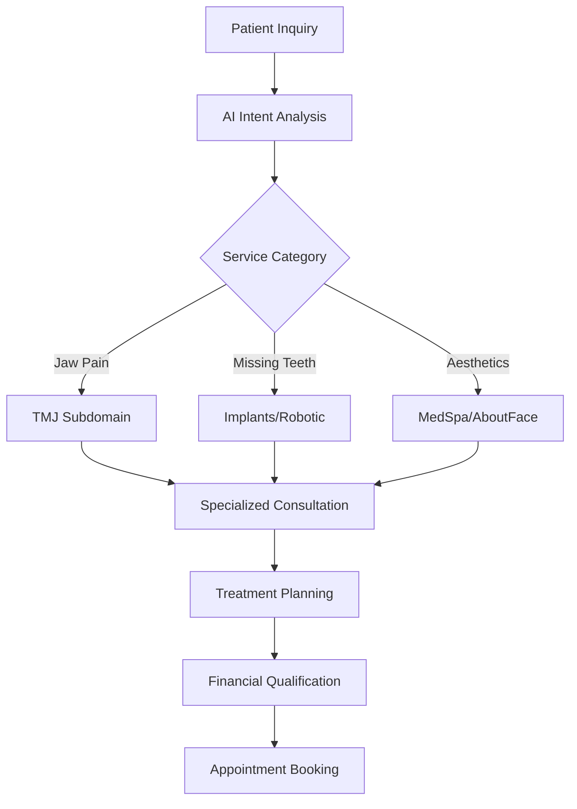

# 🦷 Dr. Pedro Advanced Dental Practice - Complete Ecosystem

> **A comprehensive multi-subdomain dental platform featuring AI-powered patient engagement, Instagram DM automation, WebRTC voice calling, and specialized service delivery across 5 distinct subdomains.**

## 📋 Table of Contents

- [🏗️ Architecture Overview](#-architecture-overview)
- [🌐 Subdomain Ecosystem](#-subdomain-ecosystem)
- [🚀 Quick Start Guide](#-quick-start-guide)
- [💻 Development Setup](#-development-setup)
- [🔧 Production Deployment](#-production-deployment)
- [🤖 AI & Automation Features](#-ai--automation-features)
- [📞 Voice Communication System](#-voice-communication-system)
- [🎨 Design System](#-design-system)
- [📊 Business Features](#-business-features)
- [🔧 Technical Stack](#-technical-stack)
- [📂 Project Structure](#-project-structure)
- [🔗 API Documentation](#-api-documentation)
- [📈 Analytics & Tracking](#-analytics--tracking)
- [💳 Financial Integration](#-financial-integration)
- [🔒 Security & Compliance](#-security--compliance)
- [📖 Documentation Index](#-documentation-index)

---

## 🏗️ Architecture Overview

The Dr. Pedro ecosystem is built as a sophisticated monorepo with microservice architecture, featuring:

### **Core Components**
```
pedro-dental-monorepo/
├── 🏠 frontend/           # Main practice website (drpedro.com)
├── ⚙️ backend/            # API server + Instagram DM + Voice Services
├── 🌐 subdomains/         # 5 specialized service domains
├── 🔗 shared/             # Cross-domain components & routing
└── 📜 scripts/            # Automation & deployment tools
```

### **Service Architecture**
- **Main Website**: Comprehensive practice overview with AI chatbot
- **Backend API**: Supabase + Express.js for data management
- **Instagram Bot**: Automated patient engagement via Claude AI
- **Voice System**: WebRTC-based calling with AI conversations
- **Subdomain Router**: Intelligent service-specific routing
- **Shared Components**: Unified UI/UX across all domains

---

## 🌐 Subdomain Ecosystem

### **Specialized Service Domains**

| Subdomain | Service Focus | Primary Technology | Target Patients |
|-----------|---------------|-------------------|-----------------|
| **[tmj.drpedro.com](subdomains/tmj/README.md)** | TMJ/TMD Treatment | BOTOX, Electrophoresis, Acoustic Therapy | Jaw pain, headaches, bruxism |
| **[implants.drpedro.com](subdomains/implants/README.md)** | General Dental Implants | Traditional implant procedures | Missing teeth, dentures |
| **[robotic.drpedro.com](subdomains/robotic/README.md)** | Yomi Robotic Surgery | AI-guided surgical precision | Complex implant cases |
| **[medspa.drpedro.com](subdomains/medspa/README.md)** | Aesthetic Services | BOTOX, dermal fillers | Facial rejuvenation |
| **[aboutface.drpedro.com](subdomains/aboutface/README.md)** | EMFACE Treatments | Non-surgical facial toning | Facial muscle enhancement |

### **Business Logic & Patient Journey**


---

## 🚀 Quick Start Guide

### **For Development (5 minutes)**
```bash
# 1. Clone and setup
git clone https://github.com/BoweryJG/pedro.git
cd pedro
npm run install:all

# 2. Start all services
npm run dev:all
# ✅ Main site: http://localhost:5173
# ✅ Backend: http://localhost:3001
# ✅ TMJ: http://localhost:5174
```

### **For Production (15 minutes)**
```bash
# 1. Deploy backend (Instagram DM + Voice automation)
# See: DEPLOYMENT.md

# 2. Deploy frontend to Netlify
npm run build:frontend
# Connect GitHub → Auto-deploy

# 3. Deploy subdomains
cd subdomains/tmj && npm run build
# Repeat for each subdomain
```

---

## 💻 Development Setup

### **Prerequisites**
- Node.js ≥18.0.0
- npm ≥9.0.0
- Git
- Supabase CLI (for backend development)

### **Environment Configuration**
```bash
# Root .env
ANTHROPIC_API_KEY=sk-ant-api03-...
SUPABASE_URL=https://your-project.supabase.co
SUPABASE_SERVICE_ROLE_KEY=eyJ...

# Frontend .env.local
VITE_OPENAI_API_KEY=sk-...
VITE_BACKEND_URL=http://localhost:3001

# Backend .env
FACEBOOK_PAGE_ACCESS_TOKEN=EAA...
INSTAGRAM_PAGE_ID=...
TWILIO_ACCOUNT_SID=AC...
TWILIO_AUTH_TOKEN=...
TWILIO_PHONE_NUMBER=+1...
HUGGINGFACE_API_KEY=hf_...
OPENROUTER_API_KEY=sk-or-...
```

### **Development Workflow**
1. **Main Development**: Use `npm run dev` in root
2. **Subdomain Development**: `cd subdomains/[service] && npm run dev`
3. **Backend Testing**: `cd backend && npm run dev`
4. **Database Management**: `cd backend && supabase start`

### **Hot Reloading & Testing**
- All services support hot reloading
- Individual subdomain development on separate ports
- Shared components auto-update across domains
- Real-time API testing with local Supabase

---

## 🔧 Production Deployment

### **Backend Deployment (Render)**
```bash
# Auto-deploy from GitHub
Repository: BoweryJG/pedro
Root Directory: backend
Build Command: npm install
Start Command: npm start
Environment: Production variables
```

### **Frontend Deployment (Netlify)**
```bash
# Main site auto-deployment
Repository: BoweryJG/pedro
Build Directory: frontend
Build Command: npm run build
Publish Directory: dist
```

### **Subdomain Deployment Strategy**
1. **Subdomain Routing**: DNS CNAME records to main Netlify
2. **Build Process**: Individual Vite builds per subdomain
3. **Shared Resources**: CDN optimization for common assets
4. **Environment Separation**: Production/staging/development

### **Environment Variables (Production)**
```env
# Backend (Render)
NODE_ENV=production
FACEBOOK_APP_SECRET=...
ANTHROPIC_API_KEY=...
SUPABASE_URL=...

# Frontend (Netlify)
VITE_ENVIRONMENT=production
VITE_API_URL=https://pedro-backend.onrender.com
```

---

## 🤖 AI & Automation Features

### **Julie Chen, DDS - Professional Medical Consultant**
- **Technology**: GPT-4 powered conversational AI
- **Methodology**: Professional medical consultation approach
- **Features**: Voice/text communication, appointment booking, treatment recommendations
- **Location**: [`frontend/src/components/JulieProfessionalLauncher.tsx`](frontend/src/components/JulieProfessionalLauncher.tsx)

### **Instagram DM Automation**
- **Technology**: Claude 3.5 Sonnet + Facebook Graph API
- **Features**: Auto-response, appointment booking, sentiment analysis
- **Response Time**: <5 seconds average
- **Location**: [`backend/src/services/instagramDMHandler.js`](backend/src/services/instagramDMHandler.js)

### **Intelligent Subdomain Routing**
- **Technology**: Keyword analysis + AI intent detection
- **Features**: Automatic service recommendation based on patient queries
- **Accuracy**: >90% intent classification
- **Location**: [`shared/navigation/SubdomainRouter.tsx`](shared/navigation/SubdomainRouter.tsx)

---

## 📞 Voice Communication System

### **WebRTC Voice Calling**
- **Technology**: Browser-based WebRTC (no phone numbers required)
- **Features**: Real-time voice conversations with Julie Chen, DDS
- **Components**:
  - Speech-to-Text: Whisper via Huggingface
  - AI Conversation: GPT-3.5-turbo via OpenRouter
  - Text-to-Speech: Coqui TTS via Huggingface
  - WebSocket signaling for real-time audio streaming

### **Voice Service Architecture**
```javascript
// Backend voice service flow
WebRTC Audio → PCM Conversion → Whisper STT → AI Processing → Coqui TTS → WebRTC Audio
```

### **Appointment Booking via Voice**
- Conversational appointment scheduling
- Real-time availability checking
- SMS confirmations via Twilio
- Automatic patient record creation in Supabase

---

## 🎨 Design System

### **Luxury Design Philosophy**
- **Color Palette**: Sophisticated gradients with medical trust indicators
- **Typography**: Playfair Display (headers) + Inter (body)
- **Backgrounds**: Subtle warm whites (#FAFBFC) with dot patterns
- **Sections**: Alternating backgrounds (normal, soft gray, dark)

### **Lightweight Performance**
- CSS-only effects (no heavy animations)
- Mobile-optimized with ~3KB overhead
- GPU-accelerated transforms
- Progressive enhancement approach

### **Component Library**
- `luxury-card`: Elegant cards with subtle shadows
- `luxury-section`: Spacious content sections
- `text-gradient`: Gradient text effects
- `hover-lift`: Subtle hover interactions

---

## 📊 Business Features

### **Patient Journey Optimization**
- **Multi-touch Engagement**: Website → Voice/Chat → Instagram → Phone → In-person
- **Conversion Tracking**: Full funnel analytics from inquiry to treatment
- **Personalization**: Service-specific content and pricing

### **Financial Services Integration**
- **Financing Partners**: CareCredit, Sunbit, Cherry (ready for integration)
- **Instant Approvals**: Real-time qualification checks
- **Payment Processing**: Secure transaction handling

### **Cross-selling Opportunities**
```typescript
// Example: Patient visiting TMJ subdomain
const crossSellSuggestions = {
  tmj: ['medspa', 'aboutface'],     // Facial aesthetics after TMJ relief
  implants: ['robotic'],            // Upgrade to robotic precision
  medspa: ['aboutface', 'tmj']      // Comprehensive facial treatment
};
```

---

## 🔧 Technical Stack

### **Frontend Technologies**
- **Framework**: React 19 + TypeScript
- **UI Library**: Material-UI v7
- **Animations**: Framer Motion + GSAP
- **Build Tool**: Vite 6.3
- **State Management**: Zustand
- **Routing**: React Router v7
- **Voice/Video**: WebRTC

### **Backend Technologies**
- **Runtime**: Node.js 18+ 
- **Framework**: Express.js
- **Database**: Supabase (PostgreSQL)
- **AI Integration**: Anthropic Claude, OpenAI GPT-4, Huggingface
- **Authentication**: Supabase Auth
- **Real-time**: WebSockets, Socket.io
- **Voice Processing**: WebRTC, Whisper, Coqui TTS

### **Infrastructure**
- **Hosting**: Netlify (frontend), Render (backend)
- **Database**: Supabase Cloud
- **CDN**: Netlify Edge
- **Monitoring**: Built-in analytics + custom tracking
- **Security**: Row-level security, CORS, input sanitization

---

## 📂 Project Structure

```
pedro-dental-monorepo/
├── 📊 Root Configuration
│   ├── package.json              # Workspace configuration
│   ├── .gitignore                # Git exclusions
│   └── README.md                 # This file
│
├── 🏠 Frontend (Main Website)
│   ├── src/
│   │   ├── chatbot/              # Sophie AI assistant
│   │   ├── components/           
│   │   │   ├── JulieProfessionalLauncher.tsx  # Voice/Chat launcher
│   │   │   ├── VoiceCallButton.tsx            # WebRTC voice UI
│   │   │   └── EnhancedLuxuryNavbar.tsx       # Enhanced navigation
│   │   ├── pages/                # Route components
│   │   ├── services/             # API integrations
│   │   └── styles/               
│   │       └── luxury-design-system.css        # Lightweight design system
│   ├── public/                   # Static assets
│   └── netlify/functions/        # Serverless endpoints
│
├── ⚙️ Backend (API + Instagram + Voice)
│   ├── src/
│   │   ├── routes/               # API endpoints
│   │   ├── services/             
│   │   │   ├── instagramDMHandler.js          # Instagram automation
│   │   │   ├── webrtcVoiceService.js          # Voice calling system
│   │   │   └── voiceService.js                # Voice processing
│   │   └── templates/            # Email templates
│   ├── supabase/
│   │   ├── functions/            # Edge functions
│   │   ├── migrations/           # Database schema
│   │   └── seed/                 # Initial data
│   └── config/                   # Environment configs
│
├── 🌐 Subdomains (Specialized Services)
│   ├── tmj/                      # TMJ treatment specialist
│   ├── implants/                 # General dental implants
│   ├── robotic/                  # Yomi robotic surgery
│   ├── medspa/                   # Aesthetic services
│   └── aboutface/                # EMFACE treatments
│
├── 🔗 Shared (Cross-domain Resources)
│   ├── navigation/               # Subdomain routing logic
│   ├── components/               # Reusable UI elements
│   └── types/                    # TypeScript definitions
│
└── 📜 Scripts & Documentation
    ├── scripts/                  # Automation tools
    ├── DEPLOYMENT.md             # Production setup guide
    ├── DEPLOY_NOW.md             # Quick deployment steps
    └── CLAUDE.md                 # AI assistant context
```

---

## 🔗 API Documentation

### **Authentication Endpoints**
```typescript
POST   /auth/signup              // Create patient account
POST   /auth/signin              // User authentication
POST   /auth/signout             // Session termination
PUT    /auth/user                // Update user profile
```

### **Appointment Management**
```typescript
GET    /appointments             // List user appointments
POST   /appointments             // Create new appointment
PUT    /appointments/:id         // Update appointment
DELETE /appointments/:id         // Cancel appointment
```

### **Voice Communication**
```typescript
POST   /api/voice/start          // Initialize WebRTC session
POST   /api/voice/audio          // Stream audio chunks
POST   /api/voice/end            // End voice session
GET    /api/voice/transcripts    // Get conversation history
```

### **Instagram DM Automation**
```typescript
POST   /api/instagram/webhook    // Facebook webhook receiver
GET    /instagram-dashboard      // Admin conversation view
POST   /api/ai/intent-analysis   // Patient intent detection
```

### **Service Information**
```typescript
GET    /services                 // All dental services
GET    /services/yomi-features   // Robotic surgery info
GET    /staff                    // Practice team
GET    /testimonials             // Patient reviews
```

---

## 📈 Analytics & Tracking

### **Patient Journey Analytics**
- **Conversion Funnel**: Visitor → Lead → Consultation → Treatment
- **Source Attribution**: Instagram, Google, Direct, Voice, Referral
- **Engagement Metrics**: Time on site, pages viewed, chatbot interactions, voice calls

### **AI Performance Metrics**
- **Response Accuracy**: Intent classification success rate
- **Response Time**: Average chatbot/Instagram/voice response speed
- **Booking Conversion**: Chat/voice interactions leading to appointments

### **Voice Analytics**
- **Call Duration**: Average conversation length
- **Sentiment Analysis**: Patient satisfaction during calls
- **Conversion Rate**: Voice calls to booked appointments

### **Business Intelligence**
- **Service Popularity**: Most requested treatments by subdomain
- **Peak Hours**: Optimal times for patient engagement
- **ROI Tracking**: Marketing spend vs. patient acquisition

---

## 💳 Financial Integration

### **Payment Processing**
- **Supported Methods**: Credit/debit cards, ACH, financing
- **Security**: PCI compliance, tokenization
- **Integration**: Ready for Stripe/Square implementation

### **Financing Partners**
```typescript
// Configured financing providers
const financingProviders = {
  carecredit: {
    endpoint: '/financing-carecredit',
    features: ['instant_approval', 'promotional_rates']
  },
  sunbit: {
    endpoint: '/financing-sunbit', 
    features: ['no_credit_check', 'instant_decision']
  },
  cherry: {
    endpoint: '/financing-cherry',
    features: ['flexible_terms', 'low_interest']
  }
};
```

### **Insurance Integration**
- **Verification**: Real-time eligibility checks
- **Partners**: PVerify, Zuub (ready for activation)
- **Claims**: Automated submission and tracking

---

## 🔒 Security & Compliance

### **Data Protection**
- **HIPAA Compliance**: Patient data encryption and access controls
- **Row-Level Security**: Database-level patient data isolation
- **API Security**: Rate limiting, input validation, CORS protection

### **Authentication & Authorization**
- **Multi-factor Authentication**: Optional 2FA for patient accounts
- **Session Management**: Secure token handling
- **Role-based Access**: Admin, staff, patient permission levels

### **Voice Security**
- **End-to-End Encryption**: WebRTC SRTP for voice data
- **No Phone Numbers**: Eliminates PSTN vulnerabilities
- **Session Tokens**: Secure WebSocket authentication

### **Infrastructure Security**
- **SSL/TLS**: End-to-end encryption
- **Environment Isolation**: Separate development/staging/production
- **Backup Strategy**: Automated daily database backups

---

## 📖 Documentation Index

### **Service-Specific Documentation**
- [TMJ Subdomain README](subdomains/tmj/README.md) - Comprehensive TMJ treatment platform
- [Implants Subdomain README](subdomains/implants/README.md) - General dental implants service
- [Robotic Subdomain README](subdomains/robotic/README.md) - Yomi robotic surgery specialization
- [MedSpa Subdomain README](subdomains/medspa/README.md) - Aesthetic services platform
- [AboutFace Subdomain README](subdomains/aboutface/README.md) - EMFACE treatment specialization

### **Technical Documentation**
- [Frontend README](frontend/README.md) - Main website development guide
- [Backend README](backend/README.md) - API server, Instagram, and voice automation
- [Deployment Guide](DEPLOYMENT.md) - Production setup instructions
- [Quick Deploy](DEPLOY_NOW.md) - Rapid deployment checklist
- [AI Context](CLAUDE.md) - Context for AI assistants

### **Business Documentation**
- [Agency Setup](AGENCY_CLIENT_SETUP.md) - Multi-client configuration
- [Facebook App Setup](FACEBOOK_APP_SETUP.md) - Instagram integration guide

---

## 🚀 Getting Started

### **I want to...**

**🔧 Develop a new feature**
```bash
git clone https://github.com/BoweryJG/pedro.git
cd pedro && npm run install:all
npm run dev
```

**📱 Set up Instagram automation**
```bash
# Follow: DEPLOYMENT.md → Instagram DM Setup
```

**🎙️ Test voice calling**
```bash
# 1. Start backend with voice service
cd backend && npm run dev

# 2. Open frontend and click "Talk to Julie"
```

**🌐 Add a new subdomain**
```bash
# Copy existing subdomain structure
cp -r subdomains/tmj subdomains/newservice
# Customize content and components
```

**🚀 Deploy to production**
```bash
# Follow: DEPLOY_NOW.md → 5-step deployment
```

---

## 🛠️ Troubleshooting

### **Common Issues**

**Voice calling not working?**
- Check Huggingface API key is set
- Verify OpenRouter API key is configured
- Ensure backend is running on port 3001

**Instagram webhooks failing?**
- Verify Facebook app is in live mode
- Check webhook URL is publicly accessible
- Confirm page access token is valid

**Supabase connection errors?**
- Check service role key is correct
- Verify database is not paused
- Ensure RLS policies are configured

---

## 📞 Support & Contact

- **Development Team**: BoweryJG development team
- **Practice Contact**: Dr. Pedro's Advanced Dental Care
- **Emergency Support**: See individual service documentation

---

## 📄 License

**Proprietary** - All rights reserved by Dr. Pedro's Advanced Dental Care and Bowery Creative Agency.

---

*Last Updated: January 2025 | Version 2.0.0*