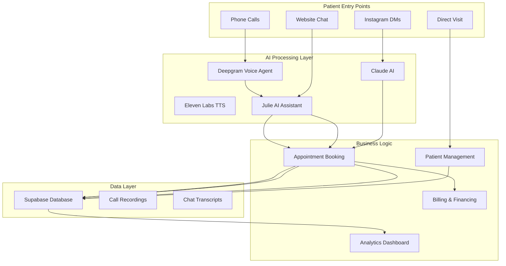

# 🦷 Dr. Pedro Advanced Dental Practice - Universal Documentation

<div align="center">
  
  
  **Enterprise Medical Practice Management Platform**
  
  [](https://gregpedromd.com)
  [](backend/ELEVENLABS_README.md)
  [](backend/README.md)
  [](PRODUCTION_DEPLOYMENT.md)
</div>

---

## 🌟 Executive Summary

Dr. Pedro's digital ecosystem is a comprehensive, AI-powered dental practice management platform featuring:

- **🤖 AI Voice Receptionist**: 24/7 automated phone answering with appointment booking
- **💬 Omnichannel Communication**: Phone, chat, Instagram DM automation
- **🏢 Multi-Tenant Architecture**: Manage multiple practices from one platform
- **📊 Advanced Analytics**: Real-time performance metrics and patient insights
- **🌐 5 Specialized Subdomains**: Service-specific patient experiences
- **💳 Integrated Financing**: CareCredit, Sunbit, Cherry payment options
- **🔒 HIPAA Compliant**: Enterprise-grade security and data protection

---

## 📑 Table of Contents

1. [System Overview](#-system-overview)
2. [Quick Start](#-quick-start)
3. [Architecture](#-architecture)
4. [Features](#-features)
5. [Development Guide](#-development-guide)
6. [Production Deployment](#-production-deployment)
7. [API Documentation](#-api-documentation)
8. [Voice AI System](#-voice-ai-system)
9. [Multi-Tenant Management](#-multi-tenant-management)
10. [Security & Compliance](#-security--compliance)
11. [Monitoring & Analytics](#-monitoring--analytics)
12. [Troubleshooting](#-troubleshooting)
13. [Documentation Index](#-documentation-index)

---

## 🎯 System Overview

### Platform Components



### Technology Stack

| Layer | Technology | Purpose |
|-------|------------|---------|
| **Frontend** | React 19, TypeScript, Vite | Modern SPA with optimal performance |
| **UI Framework** | Material-UI v7, Framer Motion | Professional design system |
| **Backend** | Node.js, Express, WebSockets | API server and real-time communication |
| **Database** | Supabase (PostgreSQL) | Scalable data storage with RLS |
| **Voice AI** | Eleven Labs + Deepgram | Natural voice synthesis and recognition |
| **Phone System** | Twilio + VoIP.ms | Multi-tenant phone management |
| **AI Models** | Claude 3.5, GPT-4, Whisper | Conversational AI and transcription |
| **Hosting** | Netlify (Frontend), Render (Backend) | Auto-scaling cloud infrastructure |

---

## 🚀 Quick Start

### Prerequisites

- Node.js ≥ 18.0.0
- npm ≥ 9.0.0
- Git
- Supabase account
- API keys for: Eleven Labs, Deepgram, Twilio, Anthropic, OpenRouter

### 1. Clone and Install

```bash
# Clone repository
git clone https://github.com/BoweryJG/pedro.git
cd pedro

# Install all dependencies
npm run install:all
```

### 2. Environment Setup

Create environment files:

**Backend (.env)**
```env
# Database
SUPABASE_URL=https://your-project.supabase.co
SUPABASE_SERVICE_ROLE_KEY=eyJ...

# Voice AI
ELEVENLABS_API_KEY=sk_...
DEEPGRAM_API_KEY=...

# Phone System
TWILIO_ACCOUNT_SID=AC...
TWILIO_AUTH_TOKEN=...
TWILIO_PHONE_NUMBER=+1...

# AI Services
ANTHROPIC_API_KEY=sk-ant-...
OPENROUTER_API_KEY=sk-or-...
HUGGINGFACE_TOKEN=hf_...

# Social Media
FACEBOOK_PAGE_ACCESS_TOKEN=EAA...
INSTAGRAM_PAGE_ID=...
```

**Frontend (.env.local)**
```env
VITE_SUPABASE_URL=https://your-project.supabase.co
VITE_SUPABASE_ANON_KEY=eyJ...
VITE_BACKEND_URL=http://localhost:3001
VITE_GOOGLE_MAPS_API_KEY=AIza...
```

### 3. Run Development

```bash
# Start everything
npm run dev:all

# Or run individually
npm run dev:frontend  # http://localhost:5173
npm run dev:backend   # http://localhost:3001
```

---

## 🏗️ Architecture

### System Architecture

```
┌─────────────────────────────────────────────────────────────┐
│                     Patient Touchpoints                      │
├─────────────┬─────────────┬─────────────┬─────────────────┤
│   Phone     │   Website   │  Instagram  │   Walk-ins      │
│  (Twilio)   │  (React)    │   (Meta)    │   (Tablet)      │
└──────┬──────┴──────┬──────┴──────┬──────┴──────┬──────────┘
       │             │             │             │
┌──────▼─────────────▼─────────────▼─────────────▼──────────┐
│                    AI Processing Layer                      │
├─────────────┬─────────────┬─────────────┬─────────────────┤
│  Deepgram   │ Eleven Labs │  Claude AI  │   Julie AI      │
│   (ASR)     │   (TTS)     │   (NLP)     │ (Orchestrator)  │
└──────┬──────┴──────┬──────┴──────┬──────┴──────┬──────────┘
       │             │             │             │
┌──────▼─────────────▼─────────────▼─────────────▼──────────┐
│                   Business Logic Layer                      │
├─────────────┬─────────────┬─────────────┬─────────────────┤
│ Appointment │   Patient   │  Billing &  │   Analytics     │
│  Booking    │ Management  │  Financing  │   Dashboard     │
└──────┬──────┴──────┬──────┴──────┬──────┴──────┬──────────┘
       │             │             │             │
┌──────▼─────────────▼─────────────▼─────────────▼──────────┐
│                      Data Layer                             │
├─────────────────────────────────────────────────────────────┤
│                 Supabase (PostgreSQL)                       │
│         Row-Level Security | Real-time Updates             │
└─────────────────────────────────────────────────────────────┘
```

### Directory Structure

```
pedro/
├── 📁 frontend/                 # Main website application
│   ├── src/
│   │   ├── components/         # React components
│   │   │   ├── dashboard/      # Analytics & management
│   │   │   ├── voice/          # Voice call interface
│   │   │   └── chat/           # Julie AI chat
│   │   ├── services/           # API integrations
│   │   ├── pages/              # Route pages
│   │   └── styles/             # Design system
│   └── public/                 # Static assets
│
├── 📁 backend/                  # API & automation server
│   ├── src/
│   │   ├── routes/             # API endpoints
│   │   ├── services/           # Business logic
│   │   │   ├── elevenLabsTTS.js     # Voice synthesis
│   │   │   ├── deepgramVoiceService.js # Phone AI
│   │   │   ├── julieAI.js           # Conversational AI
│   │   │   └── phoneNumberManager.js # Multi-tenant
│   │   └── middleware/         # Security & validation
│   ├── sql/                    # Database schemas
│   └── logs/                   # Application logs
│
├── 📁 subdomains/               # Specialized service sites
│   ├── tmj/                    # TMJ treatment
│   ├── implants/               # Dental implants
│   ├── robotic/                # Yomi robotic surgery
│   ├── medspa/                 # Aesthetic services
│   └── aboutface/              # EMFACE treatments
│
├── 📁 shared/                   # Cross-domain resources
├── 📁 scripts/                  # Automation tools
└── 📁 docs/                     # Documentation
```

---

## ✨ Features

### 🤖 AI Voice Receptionist

**Eleven Labs + Deepgram Integration**
- Natural conversation with <500ms latency
- 6 professional voice options
- Automatic appointment booking
- Emergency call detection
- Multi-language support

**Key Capabilities:**
- Answer practice information questions
- Book, reschedule, or cancel appointments
- Handle emergency situations appropriately
- Transfer to human when needed
- Send SMS confirmations

### 💬 Omnichannel Communication

**Supported Channels:**
1. **Phone**: Automated receptionist with natural voice
2. **Web Chat**: Julie AI assistant on website
3. **Instagram DMs**: Automated responses with booking
4. **SMS**: Appointment confirmations and reminders
5. **Email**: Automated follow-ups

### 📊 Analytics Dashboard

**Real-time Metrics:**
- Call volume and duration
- Conversion rates by channel
- Patient satisfaction scores
- Revenue tracking
- Staff performance metrics

**Visual Design:**
- Luxury watch-inspired interface
- Professional gauge clusters
- Interactive charts and graphs
- Mobile-responsive layout

### 🏢 Multi-Tenant Management

**Features:**
- Manage multiple dental practices
- Individual phone numbers per practice
- Separate billing and usage tracking
- Custom AI personalities per location
- Centralized dashboard

### 💳 Financial Integration

**Payment Partners:**
- CareCredit (instant approval)
- Sunbit (no credit check)
- Cherry (flexible terms)
- Traditional payment processing

**Features:**
- Real-time eligibility checks
- Instant financing decisions
- Integrated payment forms
- Automated billing

---

## 💻 Development Guide

### Project Setup

```bash
# 1. Install dependencies
npm run install:all

# 2. Set up database
cd backend
npm run db:migrate
npm run db:seed

# 3. Start development
cd ..
npm run dev:all
```

### Code Standards

**TypeScript Configuration:**
```typescript
// Frontend uses strict TypeScript
{
  "compilerOptions": {
    "target": "ES2020",
    "useDefineForClassFields": true,
    "lib": ["ES2020", "DOM", "DOM.Iterable"],
    "module": "ESNext",
    "skipLibCheck": true,
    "strict": true
  }
}
```

**Component Structure:**
```typescript
// Example React component
import { FC } from 'react';
import { Box, Typography } from '@mui/material';

interface ComponentProps {
  title: string;
  onAction: () => void;
}

export const Component: FC<ComponentProps> = ({ title, onAction }) => {
  return (
    <Box>
      <Typography variant="h2">{title}</Typography>
    </Box>
  );
};
```

### Testing

**Voice Testing:**
```bash
# Test Eleven Labs voices
cd backend
node test-nicole-voice.js
node test-all-voices.js

# Test phone system
node test-deepgram-voice.js
```

**API Testing:**
```bash
# Test endpoints
curl http://localhost:3001/api/health
curl http://localhost:3001/api/voice/test
```

### Git Workflow

```bash
# Feature development
git checkout -b feature/your-feature
git add .
git commit -m "feat: add new feature"
git push origin feature/your-feature

# Create PR on GitHub
```

---

## 🚀 Production Deployment

### Backend Deployment (Render)

1. **Connect GitHub Repository**
   - Repository: `BoweryJG/pedro`
   - Branch: `main`
   - Root Directory: `backend`

2. **Build Settings**
   - Build Command: `npm install`
   - Start Command: `npm start`

3. **Environment Variables**
   - Add all backend .env variables
   - Set `NODE_ENV=production`

4. **Health Check**
   - Path: `/api/health`
   - Expected: 200 OK

### Frontend Deployment (Netlify)

1. **Connect GitHub Repository**
   - Repository: `BoweryJG/pedro`
   - Branch: `main`
   - Base Directory: `frontend`

2. **Build Settings**
   - Build Command: `npm run build`
   - Publish Directory: `dist`

3. **Environment Variables**
   - Add all VITE_ prefixed variables
   - Set production backend URL

4. **Domain Configuration**
   - Primary: gregpedromd.com
   - Subdomains: tmj, implants, robotic, medspa, aboutface

### Database Setup (Supabase)

```sql
-- Run migrations
npm run db:migrate

-- Verify tables
SELECT * FROM clients;
SELECT * FROM phone_numbers;
SELECT * FROM appointments;
SELECT * FROM call_logs;
```

### Phone System Setup (Twilio)

1. **Configure Phone Number**
   - Voice URL: `https://[backend-url]/api/voice/incoming`
   - Method: POST
   - Fallback URL: Configure for reliability

2. **Test Configuration**
   ```bash
   curl -X POST https://[backend-url]/api/voice/test
   ```

---

## 📡 API Documentation

### Authentication

```typescript
// Patient Authentication
POST /api/auth/signup
POST /api/auth/signin
POST /api/auth/signout
GET  /api/auth/user
PUT  /api/auth/user

// Admin Authentication
POST /api/admin/login
POST /api/admin/logout
```

### Voice & Communication

```typescript
// Voice System
POST /api/voice/incoming      // Twilio webhook
POST /api/voice/start         // Start WebRTC session
POST /api/voice/audio         // Stream audio
POST /api/voice/end           // End session
GET  /api/voice/transcripts   // Get history

// Phone Management
GET  /api/phone-numbers/search
POST /api/phone-numbers/purchase
GET  /api/phone-numbers
PUT  /api/phone-numbers/:id
DELETE /api/phone-numbers/:id/release
```

### Patient Management

```typescript
// Appointments
GET    /api/appointments
POST   /api/appointments
PUT    /api/appointments/:id
DELETE /api/appointments/:id

// Patient Records
GET    /api/patients
GET    /api/patients/:id
PUT    /api/patients/:id
POST   /api/patients/search
```

### AI Services

```typescript
// Chat Integration
POST /api/chat
{
  messages: Message[],
  context?: string,
  model?: 'claude' | 'gpt4'
}

// Instagram Automation
POST /api/instagram/webhook
GET  /api/instagram/conversations
POST /api/instagram/reply
```

### Analytics

```typescript
// Dashboard Data
GET /api/analytics/overview
GET /api/analytics/calls
GET /api/analytics/appointments
GET /api/analytics/revenue
GET /api/analytics/performance
```

---

## 🎙️ Voice AI System

### Eleven Labs Integration

**Configuration:**
```javascript
const tts = new ElevenLabsTTS({
  voiceId: 'nicole',           // Julie's voice
  modelId: 'eleven_turbo_v2',  // Low latency
  stability: 0.5,              // Voice consistency
  similarityBoost: 0.75,       // Voice matching
  optimizeLatency: 4           // Maximum optimization
});
```

**Available Voices:**
| Voice | Character | Best For |
|-------|-----------|----------|
| Nicole | Friendly, warm | Primary Julie voice |
| Rachel | Professional | Business calls |
| Domi | Energetic | Marketing calls |
| Bella | Natural | Casual conversations |
| Antoni | Male, professional | Alternative option |
| Elli | Clear, precise | Technical information |

### Deepgram Voice Agent

**Features:**
- Built-in ASR with medical vocabulary
- Natural interruption handling
- Context-aware responses
- Appointment booking flow
- Emergency detection

**Configuration:**
```javascript
const voiceAgent = {
  model: 'nova-2-medical',
  language: 'en-US',
  punctuate: true,
  profanity_filter: false,
  diarize: true,
  multichannel: true
};
```

### Call Flow

```
1. Incoming Call → Twilio
2. Twilio → Backend WebSocket
3. Audio → Deepgram ASR
4. Transcript → Julie AI
5. Response → Eleven Labs TTS
6. Audio → Caller
7. Actions → Supabase
8. Confirmation → SMS
```

---

## 🏢 Multi-Tenant Management

### Architecture

```sql
-- Database structure
clients (practices)
  ├── phone_numbers
  │     ├── voice_settings
  │     └── usage_logs
  ├── appointments
  ├── patients
  └── billing
```

### Phone Number Management

**Purchase Flow:**
1. Search available numbers by area code
2. Purchase through Twilio API
3. Configure voice settings
4. Assign to practice
5. Track usage and billing

**Voice Settings Per Number:**
- Voice model selection
- Custom greetings
- Business hours
- Emergency protocols
- Transfer rules

### Billing & Usage

**Track Per Practice:**
- Total calls received
- Minutes used
- Appointments booked
- Conversion rates
- Monthly charges

**Billing Model:**
- Base platform fee
- Per-minute usage
- Per-appointment booking fee
- SMS charges
- Optional add-ons

---

## 🔒 Security & Compliance

### HIPAA Compliance

**Data Protection:**
- End-to-end encryption
- At-rest encryption in Supabase
- Encrypted backups
- Audit logging

**Access Control:**
- Role-based permissions
- Row-level security
- API key management
- Session management

### Security Features

**Application Security:**
```javascript
// Rate limiting
const rateLimiter = rateLimit({
  windowMs: 15 * 60 * 1000, // 15 minutes
  max: 100, // general endpoints
  standardHeaders: true,
  legacyHeaders: false
});

// Security headers
app.use(helmet({
  contentSecurityPolicy: {
    directives: {
      defaultSrc: ["'self'"],
      scriptSrc: ["'self'", "'unsafe-inline'"],
      styleSrc: ["'self'", "'unsafe-inline'"],
      imgSrc: ["'self'", "data:", "https:"],
    },
  },
}));
```

**API Security:**
- JWT authentication
- Request validation
- Input sanitization
- CORS protection
- Webhook verification

### Compliance Checklist

- [x] HIPAA Business Associate Agreement
- [x] SSL/TLS encryption
- [x] Data retention policies
- [x] Access logging
- [x] Regular security audits
- [x] Incident response plan
- [x] Employee training
- [x] Data backup procedures

---

## 📊 Monitoring & Analytics

### System Monitoring

**Health Checks:**
```bash
# Backend health
GET /api/health

# Database health
GET /api/health/db

# Voice system health
GET /api/health/voice

# External services
GET /api/health/services
```

**Metrics Tracked:**
- Response times
- Error rates
- API usage
- Database performance
- Voice quality scores

### Business Analytics

**Patient Journey Metrics:**
1. First contact channel
2. Conversion funnel stages
3. Drop-off points
4. Booking completion rate
5. Patient lifetime value

**Performance KPIs:**
- Average call duration
- First call resolution
- Appointment show rate
- Patient satisfaction (CSAT)
- Net Promoter Score (NPS)

### Logging

**Structured Logging:**
```javascript
// Morgan + Winston configuration
const logger = winston.createLogger({
  level: 'info',
  format: winston.format.json(),
  transports: [
    new winston.transports.File({ 
      filename: 'logs/error.log', 
      level: 'error' 
    }),
    new winston.transports.File({ 
      filename: 'logs/combined.log' 
    })
  ]
});
```

**Log Aggregation:**
- Application logs
- Call transcripts
- Error tracking
- Performance metrics
- Security events

---

## 🔧 Troubleshooting

### Common Issues

#### Voice AI Not Working

**Symptoms:** No audio, calls failing
```bash
# Check API keys
echo $ELEVENLABS_API_KEY
echo $DEEPGRAM_API_KEY

# Test voice service
curl -X POST http://localhost:3001/api/voice/test

# Check Twilio webhook
# Ensure webhook URL is: https://[backend-url]/api/voice/incoming
```

#### Database Connection Failed

**Symptoms:** 500 errors, can't load data
```bash
# Check Supabase status
curl https://[project-id].supabase.co/rest/v1/

# Verify credentials
echo $SUPABASE_URL
echo $SUPABASE_SERVICE_ROLE_KEY

# Test connection
cd backend && npm run db:migrate
```

#### Phone Number Issues

**Symptoms:** Can't purchase numbers, calls not routing
```bash
# Check Twilio balance
# Minimum $20 required

# Verify credentials
echo $TWILIO_ACCOUNT_SID
echo $TWILIO_AUTH_TOKEN

# Test number search
curl http://localhost:3001/api/phone-numbers/search?areaCode=212
```

#### Build Failures

**Symptoms:** npm install fails, build errors
```bash
# Clear caches
npm run clean
rm -rf node_modules package-lock.json

# Reinstall with legacy deps
npm install --legacy-peer-deps
npm run install:all

# Check Node version
node --version  # Must be >= 18.0.0
```

### Debug Mode

**Enable Verbose Logging:**
```javascript
// Backend
DEBUG=* npm run dev

// Frontend
VITE_DEBUG=true npm run dev
```

**Voice Debugging:**
```javascript
// Enable voice debug logs
const tts = new ElevenLabsTTS({
  debug: true,
  logLevel: 'verbose'
});
```

### Performance Issues

**Slow Response Times:**
1. Check Supabase query performance
2. Verify Eleven Labs latency settings
3. Review API rate limits
4. Check server resources

**High Error Rates:**
1. Review error logs
2. Check external service status
3. Verify API quotas
4. Test failover systems

---

## 📚 Documentation Index

### Core Documentation

| Document | Description | Location |
|----------|-------------|----------|
| **Main README** | Project overview | [README.md](README.md) |
| **Universal README** | This comprehensive guide | [README_UNIVERSAL.md](README_UNIVERSAL.md) |
| **Claude Context** | AI assistant guide | [CLAUDE.md](CLAUDE.md) |
| **Eleven Labs Guide** | Voice system details | [backend/ELEVENLABS_README.md](backend/ELEVENLABS_README.md) |

### Technical Guides

| Guide | Purpose | Location |
|-------|---------|----------|
| **Backend README** | API server documentation | [backend/README.md](backend/README.md) |
| **Frontend README** | React app documentation | [frontend/README.md](frontend/README.md) |
| **Deployment Guide** | Production setup | [DEPLOYMENT.md](DEPLOYMENT.md) |
| **Security Guide** | HIPAA compliance | [PRODUCTION_DEPLOYMENT.md](PRODUCTION_DEPLOYMENT.md) |

### Service Documentation

| Service | Documentation | Location |
|---------|---------------|----------|
| **TMJ Treatment** | Specialized TMJ services | [subdomains/tmj/README.md](subdomains/tmj/README.md) |
| **Dental Implants** | Implant procedures | [subdomains/implants/README.md](subdomains/implants/README.md) |
| **Robotic Surgery** | Yomi system guide | [subdomains/robotic/README.md](subdomains/robotic/README.md) |
| **MedSpa Services** | Aesthetic treatments | [subdomains/medspa/README.md](subdomains/medspa/README.md) |
| **EMFACE** | Facial treatments | [subdomains/aboutface/README.md](subdomains/aboutface/README.md) |

### Integration Guides

| Integration | Setup Guide | Location |
|-------------|-------------|----------|
| **Facebook/Instagram** | Social media setup | [FACEBOOK_APP_SETUP.md](FACEBOOK_APP_SETUP.md) |
| **Multi-Client Setup** | Agency configuration | [AGENCY_CLIENT_SETUP.md](AGENCY_CLIENT_SETUP.md) |
| **Voice Testing** | Test procedures | [backend/ELEVENLABS_SETUP.md](backend/ELEVENLABS_SETUP.md) |

---

## 🤝 Support & Resources

### Getting Help

**Development Support:**
- GitHub Issues: [github.com/BoweryJG/pedro/issues](https://github.com/BoweryJG/pedro/issues)
- Documentation: This guide and linked resources
- Code Comments: Inline documentation

**Production Support:**
- System Status: Check health endpoints
- Error Logs: Review application logs
- Monitoring: Analytics dashboard

### External Resources

**API Documentation:**
- [Eleven Labs Docs](https://docs.elevenlabs.io/)
- [Deepgram Docs](https://developers.deepgram.com/)
- [Twilio Docs](https://www.twilio.com/docs)
- [Supabase Docs](https://supabase.com/docs)

**Framework Documentation:**
- [React 19](https://react.dev/)
- [Material-UI](https://mui.com/)
- [Vite](https://vitejs.dev/)
- [Express.js](https://expressjs.com/)

### Contributing

**Code Standards:**
1. Follow existing patterns
2. Add tests for new features
3. Update documentation
4. Use conventional commits

**Pull Request Process:**
1. Fork repository
2. Create feature branch
3. Make changes
4. Run tests
5. Submit PR with description

---

## 📄 License & Legal

**Copyright © 2025 Dr. Pedro's Advanced Dental Care**

This is proprietary software. All rights reserved.

**Third-Party Licenses:**
- React: MIT License
- Material-UI: MIT License
- Supabase: Apache 2.0
- All other dependencies: See package.json

**Data Privacy:**
- HIPAA compliant
- Patient data encrypted
- Regular security audits
- Privacy policy enforced

---

## 🚀 Future Roadmap

### Q1 2025
- [ ] Spanish language support
- [ ] Video consultations
- [ ] Advanced scheduling AI
- [ ] Mobile app (iOS/Android)

### Q2 2025
- [ ] Insurance verification API
- [ ] Patient portal v2
- [ ] Advanced analytics ML
- [ ] Voice cloning for Dr. Pedro

### Q3 2025
- [ ] Blockchain health records
- [ ] AR treatment visualization
- [ ] IoT device integration
- [ ] Expansion to 10+ practices

---

<div align="center">
  
**Built with ❤️ by Bowery Creative Agency**

*Empowering dental practices with cutting-edge technology*

[Website](https://gregpedromd.com) • [Support](mailto:support@gregpedromd.com) • [Documentation](README.md)

</div>