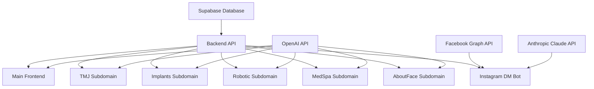

# 🚀 Production Deployment Guide - Dr. Pedro Ecosystem

> **Complete production deployment guide for the entire Dr. Pedro subdomain ecosystem, backend services, and Instagram DM automation.**

## 📋 Table of Contents

- [🎯 Deployment Overview](#-deployment-overview)
- [🏗️ Infrastructure Architecture](#-infrastructure-architecture)
- [⚡ Quick Deployment (30 minutes)](#-quick-deployment-30-minutes)
- [🔧 Backend Deployment](#-backend-deployment)
- [🌐 Frontend Deployment](#-frontend-deployment)
- [🌍 Subdomain Deployment](#-subdomain-deployment)
- [📱 Instagram DM Automation Setup](#-instagram-dm-automation-setup)
- [🔐 Environment Configuration](#-environment-configuration)
- [🗄️ Database Setup](#-database-setup)
- [📊 Analytics & Monitoring](#-analytics--monitoring)
- [🔒 Security Configuration](#-security-configuration)
- [🔄 CI/CD Pipeline](#-cicd-pipeline)
- [📈 Performance Optimization](#-performance-optimization)
- [🔍 Troubleshooting](#-troubleshooting)

---

## 🎯 Deployment Overview

### **Production Infrastructure**
```
Dr. Pedro Production Ecosystem
├── 🏠 Main Website (drpedro.com)
│   ├── Frontend: Netlify
│   └── Domain: Primary domain
├── ⚙️ Backend API (pedrobackend.onrender.com)
│   ├── Server: Render
│   ├── Database: Supabase
│   └── Instagram Bot: Integrated
├── 🌐 Subdomains
│   ├── tmj.drpedro.com (TMJ specialist)
│   ├── implants.drpedro.com (General implants)
│   ├── robotic.drpedro.com (Yomi surgery)
│   ├── medspa.drpedro.com (Aesthetic services)
│   └── aboutface.drpedro.com (EMFACE treatments)
└── 📊 Analytics & Monitoring
    ├── Google Analytics
    ├── Render Monitoring
    └── Supabase Analytics
```

### **Deployment Priority Order**
1. **Supabase Database** (Foundation)
2. **Backend API** (Core services)
3. **Main Frontend** (Primary website)
4. **Subdomains** (Specialized services)
5. **Instagram Automation** (Patient engagement)
6. **Analytics & Monitoring** (Performance tracking)

---

## 🏗️ Infrastructure Architecture

### **Service Dependencies**


### **External Service Integrations**
- **Supabase**: Database, authentication, edge functions
- **Render**: Backend hosting and deployment
- **Netlify**: Frontend hosting and CDN
- **Facebook Graph API**: Instagram DM automation
- **Anthropic Claude**: AI conversation handling
- **OpenAI GPT-4**: Chatbot intelligence
- **Google Analytics**: Traffic and conversion tracking

---

## ⚡ Quick Deployment (30 minutes)

### **Prerequisites Checklist**
- [ ] GitHub repository access (`BoweryJG/pedro`)
- [ ] Supabase account and project
- [ ] Render account
- [ ] Netlify account
- [ ] Facebook Developer account
- [ ] Anthropic API key
- [ ] OpenAI API key
- [ ] Domain DNS access (`drpedro.com`)

### **Rapid Deployment Steps**

#### **Step 1: Database Setup (5 minutes)**
```bash
# Install Supabase CLI
npm install -g supabase

# Login to Supabase
supabase login

# Create new project or link existing
supabase link --project-ref YOUR_PROJECT_REF

# Apply database migrations
cd backend
supabase db push

# Seed initial data
supabase db exec -f supabase/seed/seed_data.sql
```

#### **Step 2: Backend Deployment (10 minutes)**
```bash
# Deploy to Render (automatic from GitHub)
# 1. Connect GitHub repository: BoweryJG/pedro
# 2. Service settings:
#    - Root Directory: backend
#    - Build Command: npm install
#    - Start Command: npm start
#    - Environment: Add all backend variables
```

#### **Step 3: Frontend Deployment (10 minutes)**
```bash
# Deploy main site to Netlify
# 1. Connect GitHub repository: BoweryJG/pedro
# 2. Build settings:
#    - Base directory: frontend
#    - Build command: npm run build
#    - Publish directory: dist
#    - Environment: Add all frontend variables
```

#### **Step 4: Subdomain Deployment (5 minutes)**
```bash
# Deploy each subdomain (can be done in parallel)
# Same Netlify process for each:
# - tmj.drpedro.com
# - implants.drpedro.com  
# - robotic.drpedro.com
# - medspa.drpedro.com
# - aboutface.drpedro.com
```

---

## 🔧 Backend Deployment

### **Render Configuration**
```yaml
# render.yaml
services:
  - type: web
    name: pedro-backend
    env: node
    region: oregon
    plan: starter
    buildCommand: npm install
    startCommand: npm start
    healthCheckPath: /health
    envVars:
      - key: NODE_ENV
        value: production
      - key: PORT
        value: 3001
```

### **Backend Environment Variables**
```env
# Core Configuration
NODE_ENV=production
PORT=3001

# Supabase Configuration
SUPABASE_URL=https://your-project.supabase.co
SUPABASE_SERVICE_ROLE_KEY=eyJ... (from Supabase dashboard)

# AI Services
ANTHROPIC_API_KEY=sk-ant-api03-... (from Anthropic console)
OPENAI_API_KEY=sk-... (from OpenAI platform)

# Instagram DM Automation
FACEBOOK_APP_ID=959139930338809
FACEBOOK_APP_SECRET=... (from Facebook app settings)
FACEBOOK_PAGE_ACCESS_TOKEN=EAA... (from Messenger settings)
FACEBOOK_WEBHOOK_VERIFY_TOKEN=pedro_dental_2025
INSTAGRAM_PAGE_ID=... (your Instagram business ID)

# Practice Information
PRACTICE_NAME=Dr. Pedro Advanced Dental Care
PRACTICE_PHONE=(718) 356-9700
PRACTICE_EMAIL=info@drpedrodental.com
```

### **Deployment Commands**
```bash
# Manual deployment (if needed)
cd backend
git add .
git commit -m "Deploy backend updates"
git push origin main

# Render will auto-deploy from main branch

# Health check
curl https://pedro-backend.onrender.com/health
# Expected response: {"status": "healthy", "timestamp": "..."}
```

---

## 🌐 Frontend Deployment

### **Netlify Configuration**
```toml
# netlify.toml
[build]
  base = "frontend"
  command = "npm run build"
  publish = "dist"

[build.environment]
  NODE_VERSION = "18"

[[headers]]
  for = "/*"
  [headers.values]
    X-Frame-Options = "DENY"
    X-XSS-Protection = "1; mode=block"
    X-Content-Type-Options = "nosniff"

[[redirects]]
  from = "/*"
  to = "/index.html"
  status = 200
```

### **Frontend Environment Variables**
```env
# Core Configuration
VITE_ENVIRONMENT=production
VITE_API_URL=https://pedro-backend.onrender.com

# AI Services
VITE_OPENAI_API_KEY=sk-... (for client-side chatbot)

# Analytics
VITE_GA_TRACKING_ID=GA-MAIN-TRACKING
VITE_ANALYTICS_ENABLED=true

# CDN Configuration
VITE_CDN_URL=https://cdn.drpedro.com
VITE_IMAGE_CDN=https://cdn.drpedro.com/images
```

### **Build Optimization**
```bash
# Optimize build for production
cd frontend
npm run build

# Preview production build locally
npm run preview

# Bundle analysis (optional)
npx vite-bundle-analyzer dist
```

---

## 🌍 Subdomain Deployment

### **DNS Configuration**
```dns
# DNS Records for drpedro.com
@ A 75.2.60.5 (Netlify)
www CNAME drpedro.netlify.app
tmj CNAME drpedro.netlify.app
implants CNAME drpedro.netlify.app
robotic CNAME drpedro.netlify.app
medspa CNAME drpedro.netlify.app
aboutface CNAME drpedro.netlify.app
```

### **Subdomain Build Script**
```bash
#!/bin/bash
# deploy-subdomains.sh

SUBDOMAINS=("tmj" "implants" "robotic" "medspa" "aboutface")

for subdomain in "${SUBDOMAINS[@]}"; do
  echo "Deploying $subdomain subdomain..."
  
  cd "subdomains/$subdomain"
  
  # Install dependencies
  npm install
  
  # Build for production
  npm run build
  
  # Deploy to Netlify (requires Netlify CLI)
  netlify deploy --prod --dir=dist --site=$subdomain-drpedro
  
  cd "../.."
  
  echo "✅ $subdomain deployed successfully"
done

echo "🚀 All subdomains deployed!"
```

### **Subdomain Environment Variables**
```bash
# Each subdomain needs these variables
export VITE_ENVIRONMENT=production
export VITE_API_URL=https://pedro-backend.onrender.com
export VITE_SUBDOMAIN=tmj # (or respective subdomain)
export VITE_ANALYTICS_ID=GA-TMJ-TRACKING # (subdomain-specific)
```

---

## 📱 Instagram DM Automation Setup

### **Facebook App Configuration**
1. **Create Facebook App**
   - Go to https://developers.facebook.com/apps/create/
   - App Type: Business
   - App Name: "Dr Pedro Dental Bot"

2. **Add Messenger Product**
   - Products → Add Product → Messenger
   - Generate Page Access Token
   - Configure webhooks

3. **Instagram Business Account Setup**
   - Connect Instagram Business account to Facebook Page
   - Verify Instagram Professional account status

### **Webhook Configuration**
```bash
# Webhook setup
Callback URL: https://pedro-backend.onrender.com/api/instagram/webhook
Verify Token: pedro_dental_2025
Subscribe to: messages, messaging_postbacks, message_deliveries

# Test webhook
curl -X GET "https://pedro-backend.onrender.com/api/instagram/webhook?hub.verify_token=pedro_dental_2025&hub.challenge=test123&hub.mode=subscribe"
# Expected response: test123
```

### **Instagram DM Testing**
```bash
# Test flow
1. Send DM to Instagram business account: "Hi, I need an appointment"
2. Check Render logs for webhook reception
3. Verify Claude AI response in Instagram
4. Check dashboard at: /instagram-dashboard
```

---

## 🔐 Environment Configuration

### **Environment Variable Management**
```typescript
// Environment variable validation
const validateEnvironment = () => {
  const requiredVars = {
    backend: [
      'SUPABASE_URL',
      'SUPABASE_SERVICE_ROLE_KEY', 
      'ANTHROPIC_API_KEY',
      'FACEBOOK_PAGE_ACCESS_TOKEN'
    ],
    frontend: [
      'VITE_API_URL',
      'VITE_OPENAI_API_KEY',
      'VITE_ENVIRONMENT'
    ]
  };
  
  // Validate all required variables are present
  const missing = requiredVars.backend.filter(key => !process.env[key]);
  if (missing.length > 0) {
    throw new Error(`Missing environment variables: ${missing.join(', ')}`);
  }
};
```

### **Security Best Practices**
```bash
# Secure environment variable handling
# ✅ Use service-specific environment variables
# ✅ Rotate API keys regularly  
# ✅ Use different keys for development/production
# ✅ Never commit secrets to git
# ✅ Use environment-specific configurations
```

---

## 🗄️ Database Setup

### **Supabase Project Configuration**
```sql
-- Verify database setup
SELECT 
  schemaname,
  tablename,
  tableowner
FROM pg_tables 
WHERE schemaname = 'public';

-- Check Row Level Security
SELECT 
  tablename,
  rowsecurity
FROM pg_tables 
WHERE schemaname = 'public';

-- Verify edge functions
SELECT 
  function_name,
  status
FROM supabase_functions.functions;
```

### **Database Migration Verification**
```bash
# Check migration status
supabase db diff

# Apply any pending migrations
supabase db push

# Verify data seeding
supabase db exec -f "SELECT COUNT(*) FROM services;"
supabase db exec -f "SELECT COUNT(*) FROM staff;"
```

---

## 📊 Analytics & Monitoring

### **Google Analytics Setup**
```html
<!-- Google Analytics 4 Configuration -->
<script async src="https://www.googletagmanager.com/gtag/js?id=GA-MAIN-TRACKING"></script>
<script>
  window.dataLayer = window.dataLayer || [];
  function gtag(){dataLayer.push(arguments);}
  gtag('js', new Date());
  gtag('config', 'GA-MAIN-TRACKING');
</script>
```

### **Custom Event Tracking**
```typescript
// Track subdomain-specific events
const trackSubdomainEvent = (subdomain: string, action: string, details: any) => {
  gtag('event', action, {
    event_category: 'subdomain_interaction',
    event_label: subdomain,
    custom_parameters: details
  });
};

// Track Instagram automation events
const trackInstagramEvent = (eventType: string, messageData: any) => {
  gtag('event', 'instagram_dm', {
    event_category: 'automation',
    event_label: eventType,
    message_type: messageData.type
  });
};
```

### **Performance Monitoring**
```bash
# Render monitoring
curl https://pedro-backend.onrender.com/health

# Netlify monitoring  
curl https://drpedro.com/_netlify/functions/health

# Supabase monitoring
curl https://your-project.supabase.co/rest/v1/health
```

---

## 🔒 Security Configuration

### **SSL/TLS Setup**
```bash
# Netlify automatically provides SSL certificates
# Verify SSL configuration
curl -I https://drpedro.com
# Expected: Status 200, SSL certificate valid

# Custom domain SSL verification
openssl s_client -connect drpedro.com:443 -servername drpedro.com
```

### **CORS Configuration**
```typescript
// Backend CORS setup
const corsOptions = {
  origin: [
    'https://drpedro.com',
    'https://tmj.drpedro.com',
    'https://implants.drpedro.com',
    'https://robotic.drpedro.com',
    'https://medspa.drpedro.com',
    'https://aboutface.drpedro.com'
  ],
  credentials: true,
  methods: ['GET', 'POST', 'PUT', 'DELETE'],
  allowedHeaders: ['Content-Type', 'Authorization']
};
```

### **API Security**
```bash
# API rate limiting
Rate Limit: 100 requests per minute per IP
Authentication: Required for sensitive endpoints
Input Validation: All inputs sanitized and validated
Error Handling: No sensitive information in error responses
```

---

## 🔄 CI/CD Pipeline

### **GitHub Actions Workflow**
```yaml
# .github/workflows/deploy.yml
name: Deploy Dr Pedro Ecosystem

on:
  push:
    branches: [main]

jobs:
  deploy-backend:
    runs-on: ubuntu-latest
    steps:
      - uses: actions/checkout@v2
      - name: Deploy to Render
        run: |
          # Render auto-deploys from main branch
          echo "Backend deployment triggered"
  
  deploy-frontend:
    runs-on: ubuntu-latest
    steps:
      - uses: actions/checkout@v2
      - name: Deploy to Netlify
        run: |
          # Netlify auto-deploys from main branch
          echo "Frontend deployment triggered"
```

### **Automated Testing**
```bash
# Pre-deployment tests
npm run test:backend    # Backend API tests
npm run test:frontend   # Frontend component tests
npm run test:e2e        # End-to-end testing
npm run test:instagram  # Instagram automation tests
```

---

## 📈 Performance Optimization

### **CDN Configuration**
```json
{
  "cdn_strategy": {
    "images": "Optimized WebP with JPEG fallback",
    "fonts": "Preloaded custom fonts",
    "assets": "Versioned asset caching",
    "api_responses": "Intelligent caching headers"
  },
  "optimization": {
    "bundle_splitting": "Route-based code splitting",
    "lazy_loading": "Components and images",
    "compression": "Gzip and Brotli",
    "minification": "CSS, JS, and HTML"
  }
}
```

### **Database Optimization**
```sql
-- Index optimization
CREATE INDEX IF NOT EXISTS idx_appointments_date ON appointments(appointment_date);
CREATE INDEX IF NOT EXISTS idx_patients_email ON patients(email);
CREATE INDEX IF NOT EXISTS idx_services_category ON services(category);

-- Query performance monitoring
EXPLAIN ANALYZE SELECT * FROM appointments WHERE appointment_date = CURRENT_DATE;
```

---

## 🔍 Troubleshooting

### **Common Deployment Issues**

#### **Backend Deployment Failures**
```bash
# Check Render logs
# Common issues:
# - Environment variables missing
# - Build command failures
# - Port configuration errors

# Debug commands
curl https://pedro-backend.onrender.com/health
# Check Render dashboard for detailed logs
```

#### **Frontend Build Failures**
```bash
# Common Netlify build issues
# - Node version mismatch
# - Missing environment variables
# - Build command errors

# Debug steps
cd frontend
npm install
npm run build
# Check for TypeScript errors or missing dependencies
```

#### **Subdomain Routing Issues**
```bash
# DNS propagation check
dig tmj.drpedro.com
nslookup implants.drpedro.com

# SSL certificate verification
curl -I https://robotic.drpedro.com
```

#### **Instagram DM Automation Issues**
```bash
# Webhook verification
curl -X GET "https://pedro-backend.onrender.com/api/instagram/webhook?hub.verify_token=pedro_dental_2025&hub.challenge=test&hub.mode=subscribe"

# Check Facebook app configuration
# Verify page access token validity
# Confirm Instagram business account connection
```

### **Performance Issues**
```bash
# Frontend performance
# - Check bundle size: npx webpack-bundle-analyzer
# - Optimize images: Use WebP format
# - Enable compression: Gzip/Brotli

# Backend performance  
# - Database query optimization
# - API response caching
# - Connection pooling
```

### **Security Issues**
```bash
# SSL certificate issues
openssl s_client -connect drpedro.com:443

# CORS errors
# Check browser developer tools
# Verify allowed origins in backend configuration

# API authentication
# Verify JWT tokens
# Check API key validity
```

---

## 📞 Deployment Support

### **Emergency Contacts**
- **Development Team**: Bowery Creative Agency
- **Infrastructure**: Render, Netlify, Supabase support
- **Domain Management**: DNS provider support

### **Monitoring Dashboards**
- **Render**: https://dashboard.render.com
- **Netlify**: https://app.netlify.com
- **Supabase**: https://app.supabase.com
- **Google Analytics**: https://analytics.google.com

### **Backup & Recovery**
- **Database**: Automatic Supabase backups
- **Code**: GitHub repository backup
- **Environment**: Documented configuration
- **Secrets**: Secure key management

---

## 🎯 Post-Deployment Checklist

- [ ] All services responding to health checks
- [ ] Instagram DM automation tested and working
- [ ] All subdomains accessible and functional
- [ ] Analytics tracking verified
- [ ] SSL certificates valid on all domains
- [ ] Database migrations applied successfully
- [ ] Environment variables configured correctly
- [ ] Performance metrics within acceptable ranges
- [ ] Security headers properly configured
- [ ] Backup procedures verified

---

*Last Updated: June 27, 2025 | Deployment Guide v1.0.0*