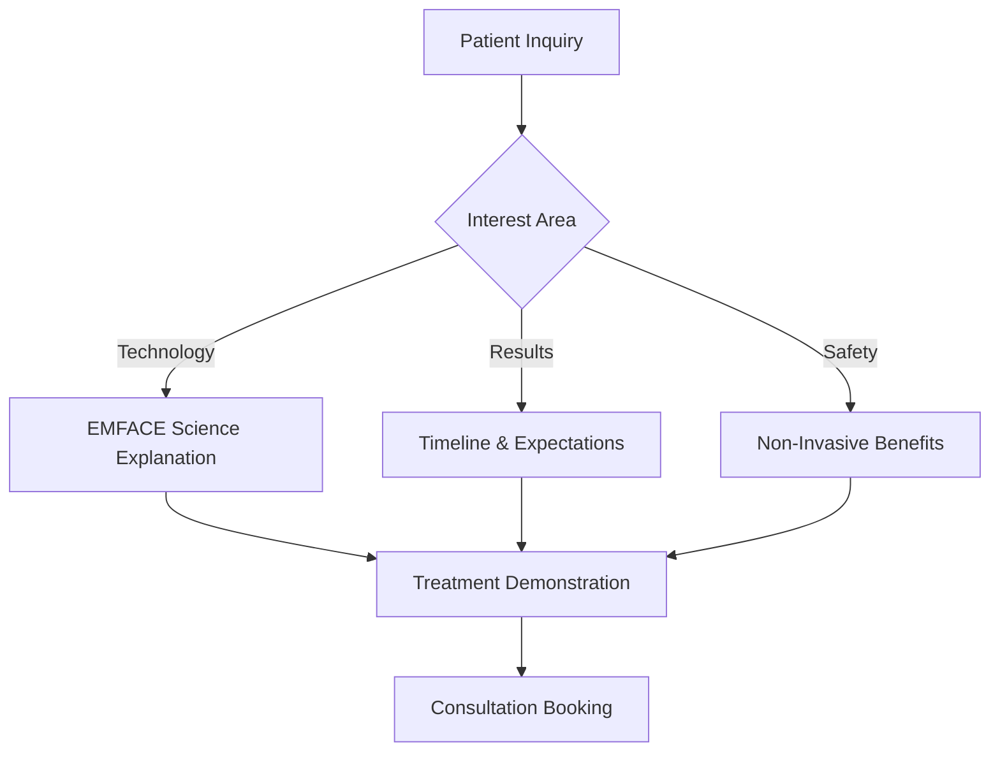

# ✨ AboutFace Subdomain - EMFACE Treatment Platform

> **Specialized EMFACE facial toning platform featuring non-surgical facial muscle stimulation, electromagnetic technology, and revolutionary facial enhancement treatments.**

## 📋 Table of Contents

- [🎯 Service Overview](#-service-overview)
- [⚡ EMFACE Technology](#-emface-technology)
- [🏗️ Architecture & Components](#-architecture--components)
- [🚀 Quick Start](#-quick-start)
- [💻 Development Setup](#-development-setup)
- [🔧 Configuration](#-configuration)
- [📱 Features & Components](#-features--components)
- [🤖 AboutFace-Specific Chatbot](#-aboutface-specific-chatbot)
- [📊 Treatment Progress Tracking](#-treatment-progress-tracking)
- [🔗 API Integration](#-api-integration)
- [📈 Analytics & Tracking](#-analytics--tracking)
- [🎨 Theme & Styling](#-theme--styling)
- [🚀 Deployment](#-deployment)
- [🔄 Troubleshooting](#-troubleshooting)

---

## 🎯 Service Overview

### **EMFACE Specialization**
The AboutFace subdomain showcases Dr. Pedro's advanced EMFACE treatment capabilities, featuring:

- **Electromagnetic Facial Toning**: Non-invasive muscle stimulation technology
- **Facial Contouring**: Natural lifting and tightening without surgery
- **Muscle Enhancement**: Targeted facial muscle strengthening and toning
- **Revolutionary Technology**: Latest generation EMFACE system

### **Target Patient Demographics**
- **Primary**: Adults seeking non-surgical facial enhancement (30-70 years)
- **Secondary**: Patients wanting muscle toning without injectables
- **Tertiary**: Clients looking for innovative facial rejuvenation alternatives

### **Treatment Benefits**
```typescript
const emfaceValueProps = {
  technology: "Revolutionary electromagnetic facial stimulation",
  results: "Natural lifting and toning without surgery",
  safety: "Non-invasive with no downtime",
  innovation: "First-of-its-kind facial muscle enhancement",
  effectiveness: "Clinically proven muscle strengthening"
};
```

### **EMFACE Advantages**
1. **Non-Surgical Enhancement**: No needles, no downtime
2. **Muscle Stimulation**: Targeted facial muscle strengthening
3. **Natural Results**: Gradual, natural-looking improvement
4. **Comfortable Treatment**: Relaxing, spa-like experience
5. **Progressive Results**: Cumulative benefits over treatment series

---

## ⚡ EMFACE Technology

### **Electromagnetic Technology**
- **Muscle Stimulation**: High-intensity focused electromagnetic (HIFEM) technology
- **Facial Contouring**: Targeted muscle groups for lifting and toning
- **Collagen Production**: Stimulates natural collagen and elastin production
- **Safe Technology**: FDA-cleared electromagnetic therapy
- **Precise Targeting**: Customizable treatment parameters

### **Treatment Mechanism**
```json
{
  "technology": "High-Intensity Focused Electromagnetic (HIFEM)",
  "mechanism": "Supramaximal muscle contractions",
  "target_muscles": [
    "Frontalis (forehead lifting)",
    "Orbicularis oculi (eye area toning)", 
    "Zygomaticus (cheek elevation)",
    "Platysma (neck tightening)"
  ],
  "session_duration": "20 minutes",
  "treatment_series": "4 sessions over 2 weeks",
  "results_timeline": "Immediate tightening, progressive improvement over 2-3 months"
}
```

### **Clinical Outcomes**
```typescript
interface EMFACEResults {
  muscle_tone_improvement: "23% average increase";
  facial_lifting: "37% improvement in facial elevation";
  skin_tightening: "30% increase in skin firmness";
  patient_satisfaction: "95% satisfaction rate";
  collagen_production: "19% increase in collagen density";
}
```

### **Dr. Pedro's EMFACE Expertise**
- **Advanced Training**: Comprehensive EMFACE system certification
- **Facial Anatomy**: Deep understanding of facial muscle structure
- **Treatment Customization**: Personalized protocols for optimal results
- **Safety Protocols**: Medical-grade treatment administration

---

## 🏗️ Architecture & Components

### **Component Hierarchy**
```
AboutFace App
├── EMFACEHero                    # Hero with EMFACE technology showcase
├── TechnologyExplanation         # EMFACE electromagnetic technology overview
├── TreatmentProcess             # Step-by-step treatment experience
├── ResultsTimeline              # Expected results progression
├── BeforeAfterShowcase          # Patient transformation gallery
├── TreatmentComparison          # EMFACE vs alternatives
├── EMFACECostCalculator         # Treatment package pricing
└── AboutFaceChatbot             # EMFACE-focused assistant
```

### **Data Architecture**
```
src/
├── components/                  # AboutFace-specific UI components
│   ├── EMFACEHero.tsx          # Main hero with technology showcase
│   ├── TechnologyExplanation.tsx   # EMFACE technology overview
│   ├── TreatmentProcess.tsx        # Treatment experience walkthrough
│   ├── ResultsTimeline.tsx         # Progressive results display
│   ├── BeforeAfterShowcase.tsx     # Patient results gallery
│   ├── TreatmentComparison.tsx     # EMFACE vs other treatments
│   ├── EMFACECostCalculator.tsx    # Package pricing calculator
│   └── AboutFaceChatbot.tsx        # EMFACE-focused assistant
├── data/
│   └── aboutfaceContent.json   # All AboutFace content and configurations
├── services/
│   └── aboutfaceApi.ts        # AboutFace-specific API integrations
├── theme/
│   └── aboutfaceTheme.ts      # AboutFace brand styling
└── App.tsx                    # Main AboutFace application component
```

### **Key Technologies**
- **Frontend**: React 19 + TypeScript + Material-UI
- **Animations**: Framer Motion for electromagnetic effect visualizations
- **3D Visualization**: Three.js for facial muscle animation
- **State Management**: Zustand for treatment progress tracking
- **Medical Visualization**: Specialized components for muscle stimulation display

---

## 🚀 Quick Start

### **Development Mode**
```bash
# From project root
cd subdomains/aboutface
npm install
npm run dev

# AboutFace subdomain available at: http://localhost:5178
```

### **Production Build**
```bash
# Build for production
npm run build

# Preview production build
npm run preview
```

### **Environment Setup**
```bash
# Copy environment template
cp .env.example .env.local

# Required environment variables
VITE_API_URL=http://localhost:3001
VITE_OPENAI_API_KEY=sk-...
VITE_ENVIRONMENT=development
VITE_SUBDOMAIN=aboutface
VITE_EMFACE_CONTENT_CDN=https://cdn.drpedro.com/emface
```

---

## 💻 Development Setup

### **Prerequisites**
- Node.js ≥18.0.0
- npm ≥9.0.0
- WebGL support for 3D muscle visualizations
- Access to main backend API

### **Local Development Workflow**
1. **Start Backend** (from root): `npm run dev:backend`
2. **Start AboutFace Subdomain**: `cd subdomains/aboutface && npm run dev`
3. **Hot Reloading**: Changes auto-reload on save
4. **Shared Components**: Updates propagate from `/shared/`

### **Development Commands**
```bash
npm run dev          # Start development server
npm run build        # Build for production
npm run lint         # ESLint code checking
npm run preview      # Preview production build
npm run type-check   # TypeScript type checking
npm run test-3d      # Test 3D visualization components
```

---

## 🔧 Configuration

### **AboutFace Theme Configuration**
```typescript
// src/theme/aboutfaceTheme.ts
export const aboutfaceTheme = createTheme({
  palette: {
    primary: {
      main: '#8E24AA',      // Deep purple - innovation, luxury
      light: '#BA68C8',     // Light purple
      dark: '#4A148C'       // Dark purple
    },
    secondary: {
      main: '#00E676',      // Bright green - energy, vitality
      light: '#69F0AE',     // Light green
      dark: '#00C853'       // Dark green
    },
    tertiary: {
      main: '#FF6F00',      // Orange - electromagnetic energy
      light: '#FFB74D',     // Light orange
      dark: '#E65100'       // Dark orange
    },
    gradient: {
      primary: 'linear-gradient(45deg, #8E24AA, #00E676)',
      secondary: 'linear-gradient(135deg, #FF6F00, #8E24AA)'
    }
  },
  typography: {
    h1: {
      fontWeight: 600,
      fontSize: '3.5rem',
      background: 'linear-gradient(45deg, #8E24AA, #00E676)',
      WebkitBackgroundClip: 'text',
      WebkitTextFillColor: 'transparent'
    },
    body1: {
      fontSize: '1.1rem',
      lineHeight: 1.7,
      color: 'text.primary'
    }
  }
});
```

### **EMFACE Animation Configuration**
```typescript
// Electromagnetic effect visualization
export const emfaceAnimationConfig = {
  electromagnetic_pulses: {
    frequency: 50, // Hz
    intensity: 0.8,
    duration: 2000, // ms
    color: '#00E676'
  },
  muscle_stimulation: {
    contraction_speed: 1.5,
    relaxation_speed: 2.0,
    visualization_layers: ['skin', 'muscle', 'electromagnetic']
  },
  facial_lifting: {
    animation_duration: 3000,
    lift_intensity: 0.3,
    smoothing_factor: 0.7
  }
};
```

---

## 📱 Features & Components

### **EMFACEHero Component**
```typescript
// Technology-focused hero section
interface EMFACEHeroProps {
  content: HeroContent;
  technologyDemo: TechnologyVisualization;
}

// Key features:
// ✅ EMFACE technology demonstration
// ✅ Electromagnetic visualization
// ✅ Treatment benefits highlight
// ✅ Non-invasive emphasis
// ✅ Results timeline preview
```

### **TechnologyExplanation Component**
```typescript
// Comprehensive EMFACE technology overview
interface TechnologyExplanationProps {
  emfaceTechnology: EMFACETechnology;
  scientificBasis: ScientificEvidence;
}

// Technology highlights:
// ⚡ Electromagnetic muscle stimulation
// 🎯 Targeted facial muscle groups
// 📊 Clinical study results
// 🔬 Scientific mechanism explanation
// 🛡️ Safety and FDA clearance
```

### **TreatmentProcess Component**
```typescript
// Step-by-step treatment experience
interface TreatmentProcessProps {
  treatmentSteps: TreatmentStep[];
  patientExperience: PatientJourney;
}

// Process visualization:
// 1️⃣ Initial consultation and assessment
// 2️⃣ Treatment planning and customization
// 3️⃣ EMFACE session experience (20 minutes)
// 4️⃣ Progressive treatment series (4 sessions)
// 5️⃣ Results development and maintenance
```

### **ResultsTimeline Component**
```typescript
// Progressive results visualization
interface ResultsTimelineProps {
  timeline: ResultsProgression;
  expectations: TreatmentExpectations;
}

// Results progression:
// 📅 Immediate: Facial tightening sensation
// 📅 1 week: Initial lifting visible
// 📅 4 weeks: Muscle tone improvement
// 📅 8 weeks: Significant facial contouring
// 📅 3 months: Maximum results achieved
```

---

## 🤖 AboutFace-Specific Chatbot

### **Chatbot Specialization**
```typescript
// EMFACE-focused conversational AI
const aboutfaceChatbotConfig = {
  knowledge: {
    technology: ['emface', 'electromagnetic', 'muscle_stimulation', 'facial_toning'],
    benefits: ['non_invasive', 'muscle_strengthening', 'facial_lifting', 'collagen_production'],
    process: ['consultation', 'treatment_series', 'progressive_results', 'maintenance'],
    comparisons: ['surgery_alternative', 'injectable_alternative', 'traditional_facials']
  },
  responses: {
    greeting: "I can explain how EMFACE revolutionizes facial enhancement...",
    technology: "Let me show you how electromagnetic technology works...",
    recommendation: "Based on your goals, EMFACE offers unique benefits..."
  }
};
```

### **EMFACE Conversation Flow**


### **Smart Response Examples**
```typescript
const aboutfaceResponses = {
  technology_curiosity: "EMFACE uses high-intensity focused electromagnetic energy to stimulate facial muscles, similar to doing thousands of facial exercises in 20 minutes. This creates stronger, more toned facial muscles for natural lifting. Would you like to see how the electromagnetic technology works?",
  
  non_invasive_interest: "EMFACE is completely non-invasive - no needles, no surgery, no downtime. You simply relax while the electromagnetic applicators stimulate your facial muscles. Most patients find it quite comfortable, almost like a facial massage. What concerns do you have about traditional facial treatments?",
  
  results_timeline: "EMFACE results develop progressively. You'll feel immediate tightening after your first session, see visible lifting after 1 week, and achieve maximum results after 3 months. The beauty is that results continue improving even after your treatment series ends. How soon are you hoping to see results?"
};
```

---

## 📊 Treatment Progress Tracking

### **Progress Measurement System**
```typescript
interface EMFACEProgress {
  session_number: 1 | 2 | 3 | 4;
  muscle_tone_improvement: number; // percentage
  facial_lifting_measurement: number; // mm
  patient_satisfaction_score: 1 | 2 | 3 | 4 | 5;
  visual_assessment: VisualAssessment;
  next_appointment: Date;
}

// Progress tracking categories:
// 📏 Facial measurements and contouring
// 💪 Muscle tone and strength improvement
// 📸 Progressive photo documentation
// ⭐ Patient satisfaction and comfort
// 📈 Treatment adherence and compliance
```

### **Results Visualization**
```typescript
const emfaceResultsTracking = {
  measurement_points: [
    'forehead_elevation',
    'eyebrow_position',
    'cheek_prominence',
    'jawline_definition',
    'neck_tightening'
  ],
  
  progress_indicators: {
    immediate: 'Facial tightening sensation',
    week_1: 'Visible lifting begins',
    week_2: 'Muscle tone improvement',
    month_1: 'Significant contouring',
    month_3: 'Maximum results achieved'
  },
  
  maintenance_protocol: {
    frequency: 'Monthly maintenance sessions',
    duration: 'Ongoing as desired',
    benefits: 'Sustained muscle tone and lifting'
  }
};
```

### **Patient Education Dashboard**
```typescript
interface PatientDashboard {
  treatment_plan: TreatmentPlan;
  progress_photos: ProgressPhotos;
  session_history: SessionHistory;
  upcoming_appointments: Appointment[];
  educational_content: EducationalResource[];
  maintenance_reminders: MaintenanceReminder[];
}
```

---

## 🔗 API Integration

### **AboutFace-Specific Endpoints**
```typescript
// src/services/aboutfaceApi.ts
export const aboutfaceApi = {
  // EMFACE treatment assessment
  submitEMFACEAssessment: async (assessment: EMFACEAssessment) => {
    return await apiClient.post('/aboutface/assessment', assessment);
  },
  
  // Treatment plan creation
  createTreatmentPlan: async (patientInfo: PatientInfo) => {
    return await apiClient.post('/aboutface/treatment-plan', patientInfo);
  },
  
  // Progress tracking
  updateTreatmentProgress: async (sessionData: SessionData) => {
    return await apiClient.post('/aboutface/progress', sessionData);
  },
  
  // Book EMFACE consultation
  bookEMFACEConsultation: async (appointmentData: AppointmentData) => {
    return await apiClient.post('/aboutface/consultation', appointmentData);
  },
  
  // Get treatment packages
  getTreatmentPackages: async () => {
    return await apiClient.get('/aboutface/packages');
  },
  
  // Educational content
  getEMFACEContent: async (category: string) => {
    return await apiClient.get(`/aboutface/education/${category}`);
  }
};
```

### **Backend Integration Points**
```typescript
// Expected backend responses
interface EMFACETreatmentPlanResponse {
  plan_id: string;
  sessions_recommended: number;
  treatment_parameters: TreatmentParameters;
  expected_timeline: Timeline;
  cost_breakdown: CostBreakdown;
  maintenance_plan: MaintenancePlan;
}

interface ProgressTrackingResponse {
  session_summary: SessionSummary;
  progress_metrics: ProgressMetrics;
  next_session_recommendations: Recommendations;
  patient_feedback: PatientFeedback;
}
```

---

## 📈 Analytics & Tracking

### **EMFACE-Specific Metrics**
```typescript
const aboutfaceAnalytics = {
  // Technology engagement metrics
  emfaceTechnologyViews: 'Electromagnetic technology explanation views',
  treatmentVisualizationInteractions: '3D muscle stimulation demo engagement',
  resultsTimelineEngagement: 'Progressive results timeline exploration',
  
  // Educational content metrics
  scientificEvidenceViews: 'Clinical study and research content views',
  treatmentProcessWalkthrough: 'Step-by-step process engagement',
  beforeAfterGalleryViews: 'Patient results gallery interaction',
  
  // Business metrics
  emfaceConsultationBookings: 'EMFACE consultation scheduling',
  treatmentPackageInterest: 'Treatment series package selection',
  innovationSeekingPatients: 'Technology-forward patient identification'
};
```

### **Innovation-Focused Patient Journey**
```typescript
// Track EMFACE patient journey
const trackEMFACEConversion = {
  technology_discovery: 'Initial EMFACE technology interest',
  science_exploration: 'Electromagnetic technology research',
  results_investigation: 'Timeline and outcome exploration',
  comparison_analysis: 'EMFACE vs alternatives comparison',
  consultation_interest: 'Treatment planning consultation request',
  appointment_scheduled: 'EMFACE consultation booked',
  treatment_commitment: 'Proceeding with EMFACE treatment series'
};
```

---

## 🎨 Theme & Styling

### **AboutFace Brand Colors**
```css
:root {
  /* Primary AboutFace Colors */
  --aboutface-primary: #8E24AA;    /* Deep purple - innovation, luxury */
  --aboutface-primary-light: #BA68C8; /* Light purple */
  --aboutface-primary-dark: #4A148C;  /* Dark purple */
  
  /* Secondary Colors */
  --aboutface-secondary: #00E676;  /* Bright green - energy, vitality */
  --aboutface-accent: #69F0AE;     /* Light green */
  
  /* Technology Colors */
  --aboutface-electromagnetic: #FF6F00; /* Orange - energy */
  --aboutface-innovation: #7C4DFF;      /* Purple - cutting-edge */
  
  /* Gradients */
  --aboutface-gradient-primary: linear-gradient(45deg, #8E24AA, #00E676);
  --aboutface-gradient-energy: linear-gradient(135deg, #FF6F00, #8E24AA);
}
```

### **Typography System**
```typescript
// AboutFace-specific typography
const aboutfaceTypography = {
  h1: {
    fontWeight: 600,
    fontSize: '3.5rem',
    background: 'linear-gradient(45deg, #8E24AA, #00E676)',
    WebkitBackgroundClip: 'text',
    WebkitTextFillColor: 'transparent',
    marginBottom: '2rem'
  },
  h2: {
    fontWeight: 500,
    fontSize: '2.5rem',
    color: 'primary.main'
  },
  body1: {
    fontSize: '1.1rem',
    lineHeight: 1.7,
    color: 'text.primary'
  },
  technology: {
    fontFamily: 'Roboto Mono',
    fontSize: '0.95rem',
    color: 'secondary.main',
    backgroundColor: 'rgba(142, 36, 170, 0.1)',
    padding: '0.5rem',
    borderRadius: '4px'
  }
};
```

### **Component Styling Approach**
- **Innovative Aesthetic**: Cutting-edge, futuristic design elements
- **Energy Visualization**: Dynamic gradients and electromagnetic effects
- **Luxury Positioning**: Premium technology and treatment representation
- **Scientific Credibility**: Medical-grade technology emphasis

---

## 🚀 Deployment

### **Netlify Deployment**
```bash
# Build AboutFace subdomain
cd subdomains/aboutface
npm run build

# Deploy to aboutface.drpedro.com
netlify deploy --prod --dir=dist
```

### **Environment Configuration**
```env
# AboutFace Production Environment
VITE_ENVIRONMENT=production
VITE_API_URL=https://pedrobackend.onrender.com
VITE_SUBDOMAIN=aboutface
VITE_ANALYTICS_ID=GA-ABOUTFACE-TRACKING
VITE_EMFACE_CONTENT_CDN=https://cdn.drpedro.com/emface
VITE_3D_VISUALIZATION_CDN=https://cdn.drpedro.com/3d/emface
```

### **Content Delivery Network**
```json
{
  "emface_assets": {
    "technology_videos": "https://cdn.drpedro.com/emface/videos/",
    "3d_muscle_models": "https://cdn.drpedro.com/emface/3d/",
    "before_after_gallery": "https://cdn.drpedro.com/emface/results/"
  },
  "optimization": {
    "video_compression": "H.264 with multiple bitrates",
    "3d_model_compression": "Draco geometry compression",
    "progressive_loading": "Staged asset loading for performance"
  }
}
```

### **Production Checklist**
- [ ] Environment variables configured
- [ ] EMFACE content assets uploaded to CDN
- [ ] 3D visualization performance optimized
- [ ] Technology demonstration videos optimized
- [ ] Mobile responsiveness confirmed
- [ ] Analytics tracking implemented
- [ ] SEO optimization completed
- [ ] Medical claim compliance verified

---

## 🔄 Troubleshooting

### **Common Development Issues**

#### **3D Muscle Visualization Problems**
```typescript
// Check WebGL and 3D support
const check3DVisualizationSupport = () => {
  const canvas = document.createElement('canvas');
  const gl = canvas.getContext('webgl2') || canvas.getContext('webgl');
  
  if (!gl) {
    console.warn('WebGL not supported, showing 2D fallback');
    return {
      webgl: false,
      fallback: 'static_diagrams'
    };
  }
  
  return {
    webgl: true,
    version: gl.getParameter(gl.VERSION)
  };
};

// Fallback for unsupported devices
const EMFACEVisualizationFallback = () => (
  <Box>
    <Typography variant="h6">
      3D visualization not supported on this device
    </Typography>
    
  </Box>
);
```

#### **Animation Performance Issues**
```typescript
// Optimize electromagnetic effect animations
const useOptimizedEMFACEAnimation = () => {
  const [performanceMode, setPerformanceMode] = useState('auto');
  
  useEffect(() => {
    // Detect device capabilities
    const deviceCapabilities = {
      isMobile: window.innerWidth < 768,
      isLowPerformance: navigator.hardwareConcurrency < 4,
      batteryLevel: navigator.battery?.level || 1
    };
    
    if (deviceCapabilities.isMobile || deviceCapabilities.isLowPerformance) {
      setPerformanceMode('reduced');
    } else {
      setPerformanceMode('full');
    }
  }, []);
  
  return {
    particleCount: performanceMode === 'full' ? 500 : 100,
    animationQuality: performanceMode === 'full' ? 'high' : 'medium',
    frameRate: performanceMode === 'full' ? 60 : 30
  };
};
```

---

## 📞 Support & Resources

### **Development Support**
- **Primary Developer**: Bowery Creative Agency
- **EMFACE Technology Specialist**: Advanced aesthetic technology team
- **3D Visualization Expert**: Medical visualization specialist

### **Technical Resources**
- **EMFACE Technology Documentation**: Electromagnetic therapy specifications
- **3D Medical Visualization**: Facial muscle anatomy and stimulation models
- **Animation Libraries**: Advanced electromagnetic effect libraries

### **Performance Monitoring**
- **3D Rendering Performance**: Frame rate and loading optimization
- **Technology Engagement**: EMFACE demonstration interaction metrics
- **Innovation Adoption**: Advanced treatment acceptance tracking

---

## 🎯 Future Enhancements

### **Planned Features**
1. **AR Facial Analysis**: Mobile AR for treatment area assessment
2. **Real-time Progress Tracking**: Session-by-session progress visualization
3. **AI Treatment Customization**: Machine learning for optimal parameters
4. **Virtual EMFACE Experience**: VR demonstration of treatment effects

### **Technical Improvements**
1. **Advanced 3D Rendering**: Photorealistic facial muscle visualization
2. **Interactive Simulations**: Patient-specific treatment preview
3. **Biometric Integration**: Facial analysis for treatment planning
4. **Progressive Web App**: Offline treatment tracking capabilities

---

## 🔬 Scientific Evidence & Compliance

### **Clinical Study Integration**
```typescript
interface ClinicalEvidence {
  study_title: string;
  publication_date: Date;
  sample_size: number;
  results_summary: string;
  statistical_significance: number;
  peer_reviewed: boolean;
}

// Featured clinical studies
const emfaceClinicalStudies = [
  {
    study_title: "Efficacy of EMFACE for Non-invasive Facial Lifting",
    sample_size: 150,
    results_summary: "37% improvement in facial elevation, 95% patient satisfaction",
    statistical_significance: 0.001
  }
];
```

### **Medical Claims Compliance**
- **FDA Clearance**: Verified FDA clearance status display
- **Clinical Evidence**: Peer-reviewed study citations
- **Safety Information**: Comprehensive contraindications and precautions
- **Results Disclaimers**: Individual results may vary statements

---

*Last Updated: June 27, 2025 | AboutFace Subdomain v1.0.0*