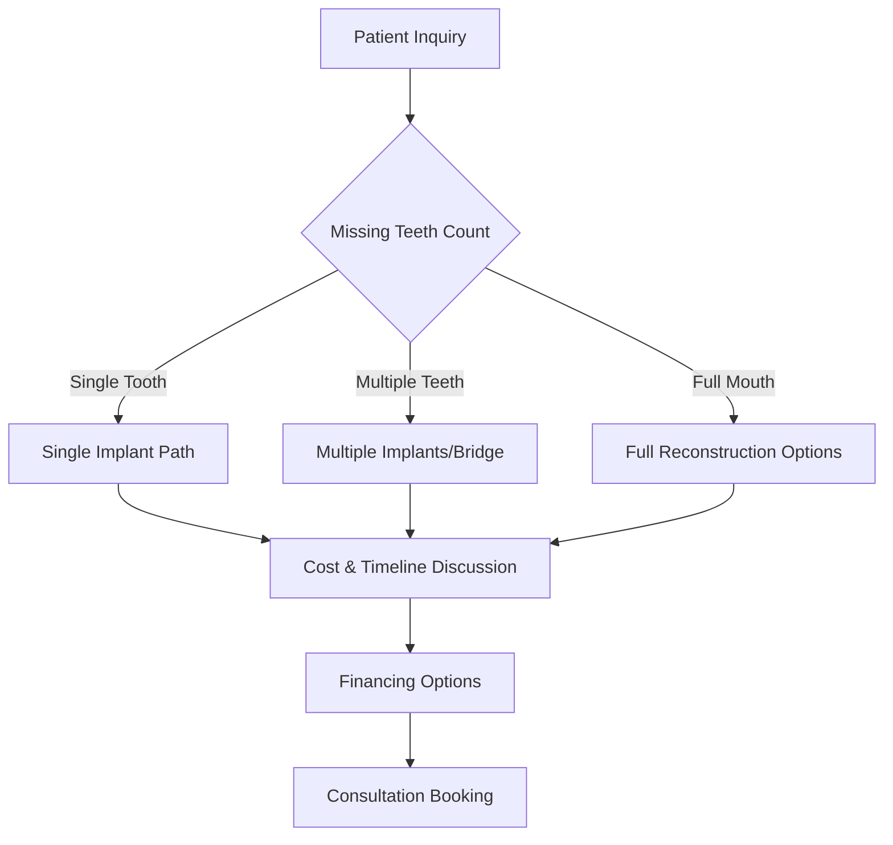

# 🦷 Implants Subdomain - General Dental Implants Platform

> **Comprehensive dental implants service platform featuring traditional implant procedures, advanced restoration techniques, and patient education resources.**

## 📋 Table of Contents

- [🎯 Service Overview](#-service-overview)
- [🏗️ Architecture & Components](#-architecture--components)
- [🚀 Quick Start](#-quick-start)
- [💻 Development Setup](#-development-setup)
- [🔧 Configuration](#-configuration)
- [📱 Features & Components](#-features--components)
- [🤖 Implants-Specific Chatbot](#-implants-specific-chatbot)
- [📊 Patient Education System](#-patient-education-system)
- [🔗 API Integration](#-api-integration)
- [📈 Analytics & Tracking](#-analytics--tracking)
- [🎨 Theme & Styling](#-theme--styling)
- [🚀 Deployment](#-deployment)
- [🔄 Troubleshooting](#-troubleshooting)

---

## 🎯 Service Overview

### **General Dental Implants Specialization**
The Implants subdomain serves as Dr. Pedro's platform for traditional dental implant procedures, featuring:

- **Traditional Implant Surgery**: Proven techniques with decades of experience
- **Comprehensive Restoration**: From single tooth to full mouth rehabilitation
- **Patient Education**: Detailed process explanation and expectation management
- **Cost-Effective Solutions**: Traditional implant options for various budgets

### **Target Patient Demographics**
- **Primary**: Patients with single or multiple missing teeth
- **Secondary**: Denture wearers seeking permanent solutions
- **Tertiary**: Patients comparing traditional vs. robotic implant options

### **Service Differentiation**
```typescript
const implantsValueProps = {
  approach: "Traditional proven techniques",
  experience: "Decades of implant surgery expertise", 
  cost: "Affordable implant solutions",
  versatility: "Single tooth to full mouth reconstruction",
  reliability: "Time-tested procedures with predictable outcomes"
};
```

### **Treatment Options**
1. **Single Tooth Implants**: Individual tooth replacement
2. **Multiple Implants**: Several missing teeth restoration
3. **Implant-Supported Bridges**: Multi-unit restorations
4. **Full Mouth Reconstruction**: Complete smile rehabilitation
5. **Implant-Supported Dentures**: Secure denture alternatives

---

## 🏗️ Architecture & Components

### **Component Hierarchy**
```
Implants App
├── ImplantsHero              # Hero section with implant benefits
├── ImplantsProcessTimeline   # Step-by-step procedure overview
├── ImplantsComparison        # Traditional vs. alternatives
├── ImplantsGallery          # Before/after patient results
├── ImplantsCostCalculator   # Treatment cost estimation
└── ImplantsChatbot          # Implants-focused assistant
```

### **Data Architecture**
```
src/
├── components/              # Implants-specific UI components
│   ├── ImplantsHero.tsx    # Main hero with implant benefits
│   ├── ImplantsProcessTimeline.tsx  # Procedure step visualization
│   ├── ImplantsComparison.tsx       # Treatment option comparison
│   ├── ImplantsGallery.tsx         # Patient result showcase
│   ├── ImplantsCostCalculator.tsx  # Cost estimation tool
│   └── ImplantsChatbot.tsx         # Implants-focused AI assistant
├── data/
│   └── implantsContent.json # All implants content and configurations
├── services/
│   └── implantsApi.ts      # Implants-specific API integrations
├── theme/
│   └── implantsTheme.ts    # Implants brand styling and colors
└── App.tsx                 # Main implants application component
```

### **Key Technologies**
- **Frontend**: React 19 + TypeScript + Material-UI
- **Animations**: Framer Motion for procedure visualizations
- **State Management**: React hooks + Zustand for complex state
- **API Layer**: Axios for backend communication
- **3D Visualization**: Three.js for implant procedure animation

---

## 🚀 Quick Start

### **Development Mode**
```bash
# From project root
cd subdomains/implants
npm install
npm run dev

# Implants subdomain available at: http://localhost:5175
```

### **Production Build**
```bash
# Build for production
npm run build

# Preview production build
npm run preview
```

### **Environment Setup**
```bash
# Copy environment template
cp .env.example .env.local

# Required environment variables
VITE_API_URL=http://localhost:3001
VITE_OPENAI_API_KEY=sk-...
VITE_ENVIRONMENT=development
VITE_SUBDOMAIN=implants
```

---

## 💻 Development Setup

### **Prerequisites**
- Node.js ≥18.0.0
- npm ≥9.0.0
- Access to main backend API
- Optional: 3D modeling tools for procedure visualization

### **Local Development Workflow**
1. **Start Backend** (from root): `npm run dev:backend`
2. **Start Implants Subdomain**: `cd subdomains/implants && npm run dev`
3. **Hot Reloading**: Changes auto-reload on save
4. **Shared Components**: Updates propagate from `/shared/`

### **Development Commands**
```bash
npm run dev          # Start development server
npm run build        # Build for production
npm run lint         # ESLint code checking
npm run preview      # Preview production build
npm run type-check   # TypeScript type checking
```

---

## 🔧 Configuration

### **Implants Theme Configuration**
```typescript
// src/theme/implantsTheme.ts
export const implantsTheme = createTheme({
  palette: {
    primary: {
      main: '#1976D2',      // Professional blue
      light: '#42A5F5',     // Lighter blue
      dark: '#1565C0'       // Darker blue
    },
    secondary: {
      main: '#FFC107',      // Gold accent (premium feel)
      light: '#FFD54F',     // Light gold
      dark: '#FF8F00'       // Dark gold
    },
    success: {
      main: '#4CAF50'       // Success green
    }
  },
  typography: {
    h1: {
      fontWeight: 600,
      fontSize: '2.5rem',
      color: 'primary.main'
    }
  }
});
```

### **Content Management**
```json
// src/data/implantsContent.json structure
{
  "hero": {
    "title": "Dental Implants - Permanent Tooth Replacement",
    "subtitle": "Restore Your Smile with Time-Tested Implant Technology",
    "benefits": [
      "Permanent tooth replacement solution",
      "Preserve jawbone and facial structure", 
      "Eat and speak with confidence",
      "No special maintenance required"
    ]
  },
  "procedures": [
    {
      "name": "Single Tooth Implant",
      "description": "Replace one missing tooth with a natural-looking implant",
      "duration": "2-6 months total treatment",
      "success_rate": "95-98%"
    }
  ]
}
```

---

## 📱 Features & Components

### **ImplantsHero Component**
```typescript
// Primary hero section features
interface ImplantsHeroProps {
  content: HeroContent;
  statistics: ImplantStatistics;
}

// Key features:
// ✅ Implant benefits and advantages
// ✅ Success rate statistics (95-98%)
// ✅ Treatment timeline overview
// ✅ Free consultation booking
// ✅ Compare with other tooth replacement options
```

### **ImplantsProcessTimeline Component**
```typescript
// Step-by-step procedure visualization
interface ProcessTimelineProps {
  steps: ProcedureStep[];
  timeline: TimelinePhase[];
}

// Process stages:
// 1️⃣ Initial consultation and X-rays
// 2️⃣ Treatment planning and preparation
// 3️⃣ Implant placement surgery
// 4️⃣ Healing and osseointegration (3-6 months)
// 5️⃣ Crown placement and final restoration
```

### **ImplantsComparison Component**
```typescript
// Treatment option comparison tool
interface ComparisonProps {
  options: TreatmentOption[];
  criteria: ComparisonCriteria[];
}

// Comparison categories:
// 💰 Cost comparison (implants vs bridges vs dentures)
// ⏱️ Treatment timeline
// 🔧 Maintenance requirements
// 📈 Longevity and durability
// 😊 Patient satisfaction scores
```

### **ImplantsCostCalculator Component**
```typescript
// Interactive cost estimation tool
interface CostCalculatorProps {
  pricing: PricingStructure;
  insuranceCoverage: InsuranceInfo;
}

// Calculator features:
// 🧮 Number of implants needed
// 💳 Insurance coverage estimation
// 💰 Financing options display
// 📊 Cost breakdown (implant + crown + procedure)
// 📅 Payment plan options
```

---

## 🤖 Implants-Specific Chatbot

### **Chatbot Specialization**
```typescript
// Implants-focused conversational AI
const implantsChatbotConfig = {
  knowledge: {
    procedures: ['single_implant', 'multiple_implants', 'full_mouth'],
    materials: ['titanium', 'zirconia', 'ceramic_crowns'],
    timeline: ['immediate', 'traditional', 'delayed_loading'],
    costs: ['single_tooth', 'multiple_teeth', 'full_arch']
  },
  responses: {
    greeting: "I can help you understand dental implant options...",
    assessment: "Let me learn about your missing teeth situation...",
    recommendation: "Based on your needs, here are your implant options..."
  }
};
```

### **Implants Conversation Flow**


### **Smart Response Examples**
```typescript
const implantsResponses = {
  single_tooth: "A single dental implant is often the best long-term solution for replacing one missing tooth. Unlike bridges, implants don't require modifying adjacent healthy teeth. Would you like to know about the process?",
  
  multiple_teeth: "For multiple missing teeth, we can use individual implants or implant-supported bridges. The best option depends on the location and number of missing teeth. How many teeth are you looking to replace?",
  
  cost_concern: "Dental implants are an investment in your long-term oral health. When you consider their 20+ year lifespan, they're often more cost-effective than alternatives that need replacement. Would you like to explore financing options?"
};
```

---

## 📊 Patient Education System

### **Educational Content Categories**
```typescript
interface EducationModule {
  category: 'procedure' | 'recovery' | 'maintenance' | 'alternatives';
  content: EducationalContent[];
  interactivity: InteractiveElement[];
}

// Education modules:
// 📚 Implant procedure step-by-step
// 🩹 Recovery and healing process
// 🦷 Long-term implant care
// ⚖️ Implants vs. other options
// 💰 Cost and insurance information
```

### **Interactive Learning Tools**
1. **3D Implant Visualization**
   - Implant placement animation
   - Osseointegration process
   - Crown attachment procedure

2. **Recovery Timeline**
   - Day-by-day healing expectations
   - Do's and don'ts during recovery
   - When to contact the office

3. **Maintenance Guide**
   - Daily cleaning techniques
   - Professional maintenance schedule
   - Signs to watch for

### **Patient Success Stories**
```typescript
const patientStories = {
  categories: ['single_tooth', 'multiple_teeth', 'full_mouth'],
  content: {
    before_after_photos: 'Visual transformation results',
    testimonials: 'Patient experience narratives',
    timeline_documentation: 'Real treatment progression',
    satisfaction_scores: 'Quantified patient outcomes'
  }
};
```

---

## 🔗 API Integration

### **Implants-Specific Endpoints**
```typescript
// src/services/implantsApi.ts
export const implantsApi = {
  // Get implant treatment options
  getTreatmentOptions: async (patientInfo: PatientInfo) => {
    return await apiClient.post('/implants/treatment-options', patientInfo);
  },
  
  // Cost estimation
  calculateCost: async (requirements: TreatmentRequirements) => {
    return await apiClient.post('/implants/cost-estimate', requirements);
  },
  
  // Insurance verification
  verifyInsurance: async (insuranceInfo: InsuranceInfo) => {
    return await apiClient.post('/implants/insurance-verify', insuranceInfo);
  },
  
  // Book implant consultation
  bookConsultation: async (appointmentData: AppointmentData) => {
    return await apiClient.post('/implants/consultation', appointmentData);
  },
  
  // Get patient education content
  getEducationContent: async (topic: string) => {
    return await apiClient.get(`/implants/education/${topic}`);
  }
};
```

### **Backend Integration Points**
```typescript
// Expected backend responses
interface TreatmentOptionsResponse {
  recommended_treatment: 'single' | 'multiple' | 'full_mouth';
  timeline: TimelineEstimate;
  cost_range: CostRange;
  financing_options: FinancingOption[];
  insurance_coverage: InsuranceCoverage;
}

interface CostEstimateResponse {
  total_cost: number;
  breakdown: CostBreakdown;
  insurance_portion: number;
  patient_portion: number;
  financing_plans: PaymentPlan[];
}
```

---

## 📈 Analytics & Tracking

### **Implants-Specific Metrics**
```typescript
const implantsAnalytics = {
  // Patient engagement metrics
  treatmentOptionViews: 'Which implant options are most viewed',
  costCalculatorUsage: 'Cost estimation tool engagement',
  consultationBookings: 'Conversion to consultation appointments',
  
  // Educational content engagement
  procedureVideoViews: 'Patient education video completion rates',
  beforeAfterGalleryViews: 'Patient results gallery engagement',
  recoveryGuideDownloads: 'Post-procedure care guide usage',
  
  // Business metrics
  implantInquiryQuality: 'Lead qualification scoring',
  treatmentValueTracking: 'Average treatment value by patient',
  competitorComparisons: 'Implants vs. alternatives selection'
};
```

### **Conversion Funnel Tracking**
```typescript
// Track implants patient journey
const trackImplantsConversion = {
  initial_visit: 'Landing page view',
  treatment_exploration: 'Implant options review',
  cost_investigation: 'Cost calculator usage',
  education_engagement: 'Patient education content consumption',
  consultation_intent: 'Booking process initiation',
  appointment_scheduled: 'Successful consultation booking',
  treatment_acceptance: 'Proceeding with implant treatment'
};
```

---

## 🎨 Theme & Styling

### **Implants Brand Colors**
```css
:root {
  /* Primary Implants Colors */
  --implants-primary: #1976D2;    /* Professional blue - trust, expertise */
  --implants-primary-light: #42A5F5; /* Lighter blue */
  --implants-primary-dark: #1565C0;  /* Darker blue */
  
  /* Secondary Colors */
  --implants-secondary: #FFC107;   /* Gold accent - premium quality */
  --implants-accent: #FFD54F;      /* Light gold */
  
  /* Functional Colors */
  --implants-success: #4CAF50;     /* Successful treatment */
  --implants-info: #2196F3;       /* Informational content */
  --implants-neutral: #757575;    /* Secondary text */
}
```

### **Typography System**
```typescript
// Implants-specific typography
const implantsTypography = {
  h1: {
    fontWeight: 600,
    fontSize: '2.5rem',
    color: 'primary.main',
    marginBottom: '1.5rem'
  },
  h2: {
    fontWeight: 500,
    fontSize: '2rem',
    color: 'primary.dark'
  },
  body1: {
    fontSize: '1rem',
    lineHeight: 1.7,
    color: 'text.primary'
  },
  caption: {
    fontSize: '0.875rem',
    color: 'text.secondary',
    fontWeight: 400
  }
};
```

### **Component Styling Approach**
- **Professional Medical Aesthetic**: Clean, trustworthy, clinical feel
- **Premium Positioning**: Quality materials and craftsmanship emphasis
- **Educational Focus**: Clear information hierarchy
- **Accessibility**: WCAG 2.1 AA compliance for all users

---

## 🚀 Deployment

### **Netlify Deployment**
```bash
# Build implants subdomain
cd subdomains/implants
npm run build

# Deploy to implants.drpedro.com
netlify deploy --prod --dir=dist
```

### **Environment Configuration**
```env
# Implants Production Environment
VITE_ENVIRONMENT=production
VITE_API_URL=https://pedrobackend.onrender.com
VITE_SUBDOMAIN=implants
VITE_ANALYTICS_ID=GA-IMPLANTS-TRACKING
```

### **DNS Configuration**
```dns
# DNS CNAME record
implants.drpedro.com CNAME drpedro.netlify.app
```

### **Production Checklist**
- [ ] Environment variables configured
- [ ] API endpoints tested
- [ ] Implants content reviewed and approved
- [ ] Cost calculator functionality verified
- [ ] Before/after gallery optimized
- [ ] Mobile responsiveness confirmed
- [ ] SEO optimization implemented
- [ ] Analytics tracking verified

---

## 🔄 Troubleshooting

### **Common Development Issues**

#### **Port Conflicts**
```bash
# If port 5175 is in use
npx kill-port 5175
npm run dev
```

#### **3D Visualization Issues**
```typescript
// Check WebGL support
const checkWebGLSupport = () => {
  const canvas = document.createElement('canvas');
  const gl = canvas.getContext('webgl') || canvas.getContext('experimental-webgl');
  return !!gl;
};

// Fallback for unsupported browsers
if (!checkWebGLSupport()) {
  console.warn('WebGL not supported, using 2D visualizations');
}
```

#### **Cost Calculator Accuracy**
```typescript
// Verify pricing data integrity
const validatePricingData = (pricing: PricingStructure) => {
  const requiredFields = ['implant_cost', 'crown_cost', 'procedure_fee'];
  return requiredFields.every(field => pricing[field] && pricing[field] > 0);
};
```

### **Performance Optimization**

#### **Image Gallery Optimization**
```typescript
// Lazy load before/after images
const ImplantsGallery = () => {
  const [images, setImages] = useState([]);
  
  useEffect(() => {
    // Load images progressively
    const loadImages = async () => {
      const optimizedImages = await import('./assets/implants-gallery');
      setImages(optimizedImages.default);
    };
    
    loadImages();
  }, []);
};
```

#### **Cost Calculator Performance**
```typescript
// Debounce cost calculations
const useDebouncedCostCalculation = (inputs: CalculatorInputs, delay: number) => {
  const [result, setResult] = useState(null);
  
  useEffect(() => {
    const timer = setTimeout(() => {
      calculateImplantCost(inputs).then(setResult);
    }, delay);
    
    return () => clearTimeout(timer);
  }, [inputs, delay]);
  
  return result;
};
```

---

## 📞 Support & Resources

### **Development Support**
- **Primary Developer**: Bowery Creative Agency
- **Implants Content Expert**: Dr. Pedro's practice team
- **Technical Issues**: See main project README for contact

### **Medical Content Updates**
- **Treatment Information**: Coordinate with Dr. Pedro
- **Pricing Updates**: Practice management approval required
- **Before/After Photos**: Patient consent and privacy compliance

### **Performance Monitoring**
- **Cost Calculator Analytics**: Track calculation completion rates
- **Education Content Engagement**: Monitor patient learning patterns
- **Conversion Optimization**: A/B testing for consultation bookings

---

## 🎯 Future Enhancements

### **Planned Features**
1. **Virtual Implant Planning**: 3D scanning and placement simulation
2. **Patient Portal Integration**: Treatment progress tracking
3. **Financing Partner Integration**: Real-time approval processes
4. **Advanced Cost Calculator**: Insurance integration and real-time pricing

### **Technical Improvements**
1. **AR Visualization**: Mobile AR for implant placement preview
2. **AI Treatment Planning**: Machine learning for optimal implant positioning
3. **Patient Communication Tools**: Automated follow-up and care instructions
4. **Integration with Robotic Subdomain**: Upgrade path recommendations

---

*Last Updated: June 27, 2025 | Implants Subdomain v1.0.0*