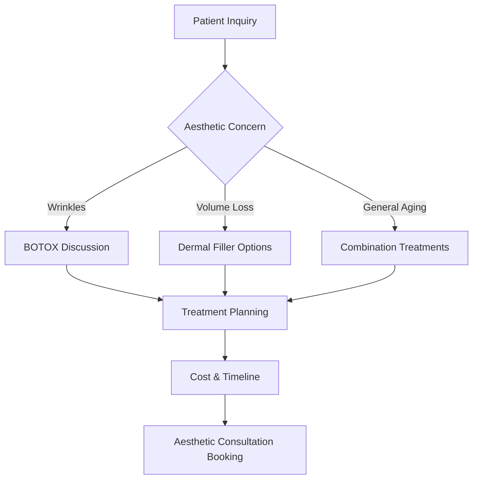

# 💆 MedSpa Subdomain - Aesthetic Services Platform

> **Comprehensive medical spa platform featuring BOTOX, dermal fillers, facial rejuvenation, and aesthetic treatments with medical-grade expertise.**

## 📋 Table of Contents

- [🎯 Service Overview](#-service-overview)
- [💉 Aesthetic Treatment Specialization](#-aesthetic-treatment-specialization)
- [🏗️ Architecture & Components](#-architecture--components)
- [🚀 Quick Start](#-quick-start)
- [💻 Development Setup](#-development-setup)
- [🔧 Configuration](#-configuration)
- [📱 Features & Components](#-features--components)
- [🤖 MedSpa-Specific Chatbot](#-medspa-specific-chatbot)
- [📊 Treatment Planning System](#-treatment-planning-system)
- [🔗 API Integration](#-api-integration)
- [📈 Analytics & Tracking](#-analytics--tracking)
- [🎨 Theme & Styling](#-theme--styling)
- [🚀 Deployment](#-deployment)
- [🔄 Troubleshooting](#-troubleshooting)

---

## 🎯 Service Overview

### **Medical Spa Specialization**
The MedSpa subdomain serves as Dr. Pedro's aesthetic services platform, featuring:

- **Injectable Treatments**: BOTOX, dermal fillers, and neuromodulators
- **Facial Rejuvenation**: Non-surgical anti-aging treatments
- **Medical-Grade Aesthetics**: Physician-administered cosmetic procedures
- **Comprehensive Consultations**: Personalized aesthetic treatment planning

### **Target Patient Demographics**
- **Primary**: Adults seeking non-surgical facial rejuvenation (25-65 years)
- **Secondary**: Patients interested in preventative aesthetic treatments
- **Tertiary**: Existing dental patients exploring complementary aesthetic services

### **Service Differentiation**
```typescript
const medspaValueProps = {
  expertise: "Physician-administered aesthetic treatments",
  safety: "Medical-grade procedures with dental precision",
  integration: "Comprehensive facial aesthetic approach",
  experience: "Decades of facial anatomy expertise",
  results: "Natural-looking, subtle enhancements"
};
```

### **Treatment Categories**
1. **Injectable Neuromodulators**: BOTOX, Dysport, Xeomin
2. **Dermal Fillers**: Hyaluronic acid, collagen stimulators
3. **Facial Rejuvenation**: Multi-modal anti-aging treatments
4. **Preventative Aesthetics**: Early intervention treatments
5. **Combination Therapies**: Integrated treatment protocols

---

## 💉 Aesthetic Treatment Specialization

### **BOTOX Expertise**
- **Medical Applications**: TMJ treatment experience enhancing cosmetic precision
- **Facial Anatomy**: Deep understanding of muscle function and facial dynamics
- **Natural Results**: Subtle enhancement maintaining facial expression
- **Safety Protocols**: Medical-grade administration and monitoring

### **Dermal Filler Specialization**
```json
{
  "filler_types": {
    "hyaluronic_acid": "Volume restoration and lip enhancement",
    "calcium_hydroxylapatite": "Deep volume loss and facial contouring",
    "poly_l_lactic_acid": "Collagen stimulation for gradual improvement"
  },
  "treatment_areas": {
    "lips": "Natural volume enhancement and definition",
    "cheeks": "Midface volume restoration",
    "nasolabial_folds": "Smoothing of smile lines",
    "marionette_lines": "Corner of mouth rejuvenation"
  }
}
```

### **Dr. Pedro's Aesthetic Credentials**
- **Facial Anatomy Expertise**: Prosthodontic training in facial structure
- **TMJ Experience**: Advanced understanding of facial muscle function
- **Injection Techniques**: Precision injection skills from dental practice
- **Safety Training**: Medical-grade aesthetic training and certification

---

## 🏗️ Architecture & Components

### **Component Hierarchy**
```
MedSpa App
├── MedSpaHero                    # Hero with aesthetic transformation showcase
├── TreatmentMenuDisplay         # Available aesthetic treatments
├── BeforeAfterGallery          # Patient transformation results
├── AestheticConsultationForm   # Treatment planning questionnaire
├── TreatmentTimeline           # Procedure process and recovery
├── MedSpaPricing               # Treatment costs and packages
└── MedSpaChatbot               # Aesthetic-focused assistant
```

### **Data Architecture**
```
src/
├── components/                 # MedSpa-specific UI components
│   ├── MedSpaHero.tsx         # Main hero with transformation showcase
│   ├── TreatmentMenuDisplay.tsx    # Treatment options display
│   ├── BeforeAfterGallery.tsx     # Patient results gallery
│   ├── AestheticConsultationForm.tsx  # Treatment planning form
│   ├── TreatmentTimeline.tsx      # Procedure and recovery timeline
│   ├── MedSpaPricing.tsx          # Pricing and package display
│   └── MedSpaChatbot.tsx          # MedSpa-focused assistant
├── data/
│   └── medspaContent.json     # All MedSpa content and configurations
├── services/
│   └── medspaApi.ts          # MedSpa-specific API integrations
├── theme/
│   └── medspaTheme.ts        # MedSpa brand styling and colors
└── App.tsx                   # Main MedSpa application component
```

### **Key Technologies**
- **Frontend**: React 19 + TypeScript + Material-UI
- **Animations**: Framer Motion for elegant transitions
- **Image Processing**: Advanced before/after gallery with privacy controls
- **State Management**: Zustand for treatment planning state
- **Form Handling**: React Hook Form for consultation forms

---

## 🚀 Quick Start

### **Development Mode**
```bash
# From project root
cd subdomains/medspa
npm install
npm run dev

# MedSpa subdomain available at: http://localhost:5177
```

### **Production Build**
```bash
# Build for production
npm run build

# Preview production build
npm run preview
```

### **Environment Setup**
```bash
# Copy environment template
cp .env.example .env.local

# Required environment variables
VITE_API_URL=http://localhost:3001
VITE_OPENAI_API_KEY=sk-...
VITE_ENVIRONMENT=development
VITE_SUBDOMAIN=medspa
VITE_IMAGE_CDN_URL=https://cdn.drpedro.com/medspa
```

---

## 💻 Development Setup

### **Prerequisites**
- Node.js ≥18.0.0
- npm ≥9.0.0
- Access to main backend API
- Image optimization tools for before/after galleries

### **Local Development Workflow**
1. **Start Backend** (from root): `npm run dev:backend`
2. **Start MedSpa Subdomain**: `cd subdomains/medspa && npm run dev`
3. **Hot Reloading**: Changes auto-reload on save
4. **Shared Components**: Updates propagate from `/shared/`

### **Development Commands**
```bash
npm run dev          # Start development server
npm run build        # Build for production
npm run lint         # ESLint code checking
npm run preview      # Preview production build
npm run type-check   # TypeScript type checking
npm run optimize-images  # Optimize before/after images
```

---

## 🔧 Configuration

### **MedSpa Theme Configuration**
```typescript
// src/theme/medspaTheme.ts
export const medspaTheme = createTheme({
  palette: {
    primary: {
      main: '#E91E63',      // Pink - beauty, femininity
      light: '#F48FB1',     // Light pink
      dark: '#C2185B'       // Dark pink
    },
    secondary: {
      main: '#9C27B0',      // Purple - luxury, elegance
      light: '#CE93D8',     // Light purple
      dark: '#7B1FA2'       // Dark purple
    },
    tertiary: {
      main: '#FF9800',      // Gold - premium, luxury
      light: '#FFB74D',     // Light gold
      dark: '#F57C00'       // Dark gold
    }
  },
  typography: {
    h1: {
      fontWeight: 300,
      fontSize: '3rem',
      fontFamily: '"Playfair Display", serif',
      color: 'primary.main'
    },
    body1: {
      fontSize: '1rem',
      lineHeight: 1.7,
      fontFamily: '"Open Sans", sans-serif'
    }
  }
});
```

### **Content Management**
```json
// src/data/medspaContent.json structure
{
  "hero": {
    "title": "Medical Spa & Aesthetic Services",
    "subtitle": "Physician-Administered Beauty Treatments",
    "treatments": [
      "BOTOX & Neuromodulators",
      "Dermal Fillers",
      "Facial Rejuvenation",
      "Anti-Aging Treatments"
    ]
  },
  "treatments": [
    {
      "name": "BOTOX Cosmetic",
      "description": "Smooth fine lines and wrinkles with precision injections",
      "areas": ["Forehead", "Crow's feet", "Frown lines"],
      "duration": "10-15 minutes",
      "results": "3-6 months",
      "price_range": "$300-$600"
    }
  ]
}
```

---

## 📱 Features & Components

### **MedSpaHero Component**
```typescript
// Aesthetic-focused hero section
interface MedSpaHeroProps {
  content: HeroContent;
  transformations: TransformationShowcase;
}

// Key features:
// ✅ Before/after transformation slider
// ✅ Treatment menu highlights
// ✅ Physician credentials display
// ✅ Aesthetic consultation booking
// ✅ Treatment package showcases
```

### **TreatmentMenuDisplay Component**
```typescript
// Comprehensive treatment showcase
interface TreatmentMenuProps {
  treatments: AestheticTreatment[];
  categories: TreatmentCategory[];
}

// Treatment categories:
// 💉 Injectable Treatments (BOTOX, fillers)
// 🌟 Facial Rejuvenation
// 👄 Lip Enhancement
// 💫 Skin Tightening
// 🌸 Combination Packages
```

### **BeforeAfterGallery Component**
```typescript
// Patient transformation showcase
interface GalleryProps {
  transformations: PatientTransformation[];
  privacySettings: PrivacyConfiguration;
}

// Gallery features:
// 📸 High-quality before/after comparisons
// 🔒 Privacy-compliant patient consent
// 🎯 Treatment-specific result filtering
// 📱 Mobile-optimized image viewing
// ⭐ Patient satisfaction ratings
```

### **AestheticConsultationForm Component**
```typescript
// Treatment planning questionnaire
interface ConsultationFormProps {
  questions: ConsultationQuestion[];
  assessmentLogic: AssessmentRules;
}

// Assessment areas:
// 🎯 Aesthetic goals and concerns
// 📋 Medical history and contraindications
// 💰 Budget and treatment preferences
// ⏰ Timeline and scheduling preferences
// 📷 Photo upload for virtual assessment
```

---

## 🤖 MedSpa-Specific Chatbot

### **Chatbot Specialization**
```typescript
// MedSpa-focused conversational AI
const medspaChatbotConfig = {
  knowledge: {
    treatments: ['botox', 'fillers', 'facial_rejuvenation', 'anti_aging'],
    areas: ['forehead', 'eyes', 'lips', 'cheeks', 'nasolabial_folds'],
    concerns: ['wrinkles', 'volume_loss', 'fine_lines', 'aging'],
    safety: ['contraindications', 'recovery', 'side_effects']
  },
  responses: {
    greeting: "I can help you explore our aesthetic treatment options...",
    assessment: "Let me learn about your aesthetic goals...",
    recommendation: "Based on your concerns, these treatments might help..."
  }
};
```

### **MedSpa Conversation Flow**


### **Smart Response Examples**
```typescript
const medspaResponses = {
  wrinkle_concern: "BOTOX is excellent for dynamic wrinkles caused by muscle movement. Dr. Pedro's experience with facial anatomy ensures natural-looking results. Which areas concern you most - forehead, crow's feet, or frown lines?",
  
  volume_loss: "Dermal fillers can restore lost volume and enhance facial contours. Our hyaluronic acid fillers provide natural-looking results that last 6-18 months. Are you interested in cheek enhancement, lip augmentation, or overall volume restoration?",
  
  first_time: "It's wonderful that you're considering aesthetic treatments! Dr. Pedro's medical background ensures safe, professional care. Many patients start with a consultation to discuss goals and create a personalized treatment plan. Would you like to schedule a complimentary consultation?"
};
```

---

## 📊 Treatment Planning System

### **Aesthetic Assessment Algorithm**
```typescript
interface AestheticAssessment {
  concerns: AestheticConcern[];
  severity: 1 | 2 | 3 | 4 | 5;
  treatment_goals: TreatmentGoal[];
  timeline: 'immediate' | 'gradual' | 'maintenance';
}

// Assessment scoring:
// 🟢 1-2: Preventative treatments, minimal intervention
// 🟡 3-4: Moderate concerns, targeted treatments
// 🔴 4-5: Advanced concerns, comprehensive treatment plan
```

### **Treatment Recommendation Engine**
```typescript
const generateAestheticRecommendation = (assessment: AestheticAssessment) => {
  const recommendations = [];
  
  // Wrinkle treatment recommendations
  if (assessment.concerns.includes('dynamic_wrinkles')) {
    recommendations.push({
      treatment: 'BOTOX',
      areas: ['forehead', 'crow_feet', 'frown_lines'],
      frequency: 'every_3-4_months',
      expected_outcome: '80-90% wrinkle reduction'
    });
  }
  
  // Volume restoration recommendations
  if (assessment.concerns.includes('volume_loss')) {
    recommendations.push({
      treatment: 'dermal_fillers',
      products: ['hyaluronic_acid', 'collagen_stimulators'],
      frequency: 'every_6-18_months',
      expected_outcome: 'Natural volume restoration'
    });
  }
  
  return recommendations;
};
```

### **Treatment Package Builder**
```typescript
interface TreatmentPackage {
  name: string;
  treatments: Treatment[];
  total_cost: number;
  timeline: string;
  expected_results: string;
  maintenance_plan: MaintenancePlan;
}

// Popular packages:
// 🌟 "Natural Refresh" - BOTOX + light filler
// 💫 "Full Rejuvenation" - Comprehensive facial treatment
// 👄 "Lip Enhancement" - Lip filler + surrounding area treatment
// 🎯 "Preventative Care" - Early intervention package
```

---

## 🔗 API Integration

### **MedSpa-Specific Endpoints**
```typescript
// src/services/medspaApi.ts
export const medspaApi = {
  // Submit aesthetic assessment
  submitAestheticAssessment: async (assessment: AestheticAssessment) => {
    return await apiClient.post('/medspa/assessment', assessment);
  },
  
  // Get treatment recommendations
  getTreatmentRecommendations: async (patientInfo: PatientInfo) => {
    return await apiClient.post('/medspa/recommendations', patientInfo);
  },
  
  // Calculate treatment costs
  calculateTreatmentCost: async (treatments: TreatmentSelection[]) => {
    return await apiClient.post('/medspa/cost-calculation', treatments);
  },
  
  // Book aesthetic consultation
  bookAestheticConsultation: async (appointmentData: AppointmentData) => {
    return await apiClient.post('/medspa/consultation', appointmentData);
  },
  
  // Get before/after gallery
  getPatientGallery: async (filters: GalleryFilters) => {
    return await apiClient.get('/medspa/gallery', { params: filters });
  },
  
  // Virtual consultation upload
  uploadConsultationPhotos: async (photos: File[]) => {
    const formData = new FormData();
    photos.forEach(photo => formData.append('photos', photo));
    return await apiClient.post('/medspa/virtual-consultation', formData);
  }
};
```

### **Backend Integration Points**
```typescript
// Expected backend responses
interface TreatmentRecommendationResponse {
  recommended_treatments: RecommendedTreatment[];
  treatment_plan: TreatmentPlan;
  cost_estimate: CostEstimate;
  timeline: TreatmentTimeline;
  contraindications: string[];
}

interface AestheticConsultationResponse {
  consultation_id: string;
  recommended_approach: TreatmentApproach;
  virtual_assessment: VirtualAssessment;
  next_steps: NextStep[];
}
```

---

## 📈 Analytics & Tracking

### **MedSpa-Specific Metrics**
```typescript
const medspaAnalytics = {
  // Patient engagement metrics
  aestheticAssessmentCompletions: 'Assessment form completion rate',
  treatmentMenuInteractions: 'Treatment option exploration',
  beforeAfterGalleryViews: 'Patient results engagement',
  
  // Consultation metrics
  virtualConsultationUploads: 'Photo consultation submissions',
  consultationBookings: 'In-person consultation scheduling',
  treatmentPackageInterest: 'Package vs individual treatment interest',
  
  // Business metrics
  averageTreatmentValue: 'Patient spending per visit',
  treatmentRetentionRate: 'Repeat treatment bookings',
  crossSellOpportunities: 'Dental to aesthetic service conversion'
};
```

### **Patient Journey Analytics**
```typescript
// Track MedSpa patient journey
const trackMedSpaConversion = {
  aesthetic_discovery: 'Initial aesthetic interest',
  treatment_exploration: 'Treatment menu engagement',
  results_review: 'Before/after gallery viewing',
  assessment_completion: 'Aesthetic assessment submission',
  consultation_interest: 'Virtual or in-person consultation request',
  appointment_booked: 'Aesthetic consultation scheduled',
  treatment_acceptance: 'Proceeding with aesthetic treatment'
};
```

---

## 🎨 Theme & Styling

### **MedSpa Brand Colors**
```css
:root {
  /* Primary MedSpa Colors */
  --medspa-primary: #E91E63;      /* Pink - beauty, femininity */
  --medspa-primary-light: #F48FB1; /* Light pink */
  --medspa-primary-dark: #C2185B;  /* Dark pink */
  
  /* Secondary Colors */
  --medspa-secondary: #9C27B0;    /* Purple - luxury, elegance */
  --medspa-accent: #CE93D8;       /* Light purple */
  
  /* Luxury Colors */
  --medspa-gold: #FF9800;         /* Gold - premium */
  --medspa-rose-gold: #E8B4B8;    /* Rose gold accent */
  
  /* Functional Colors */
  --medspa-success: #8BC34A;      /* Treatment success */
  --medspa-neutral: #F5F5F5;      /* Background */
}
```

### **Typography System**
```typescript
// MedSpa-specific typography
const medspaTypography = {
  h1: {
    fontWeight: 300,
    fontSize: '3rem',
    fontFamily: '"Playfair Display", serif',
    color: 'primary.main',
    marginBottom: '1.5rem'
  },
  h2: {
    fontWeight: 400,
    fontSize: '2.25rem',
    fontFamily: '"Playfair Display", serif',
    color: 'primary.dark'
  },
  body1: {
    fontSize: '1rem',
    lineHeight: 1.7,
    fontFamily: '"Open Sans", sans-serif',
    color: 'text.primary'
  },
  elegant: {
    fontFamily: '"Dancing Script", cursive',
    fontSize: '1.5rem',
    color: 'secondary.main',
    fontWeight: 400
  }
};
```

### **Component Styling Approach**
- **Elegant Aesthetic**: Sophisticated, beauty-focused design
- **Luxury Feel**: Premium materials and finishes representation
- **Feminine Appeal**: Soft curves and graceful transitions
- **Trust & Safety**: Medical credibility with aesthetic appeal

---

## 🚀 Deployment

### **Netlify Deployment**
```bash
# Build MedSpa subdomain
cd subdomains/medspa
npm run build

# Deploy to medspa.drpedro.com
netlify deploy --prod --dir=dist
```

### **Environment Configuration**
```env
# MedSpa Production Environment
VITE_ENVIRONMENT=production
VITE_API_URL=https://pedrobackend.onrender.com
VITE_SUBDOMAIN=medspa
VITE_ANALYTICS_ID=GA-MEDSPA-TRACKING
VITE_IMAGE_CDN_URL=https://cdn.drpedro.com/medspa
```

### **Image Optimization Pipeline**
```json
{
  "before_after_images": {
    "format": "WebP with JPEG fallback",
    "compression": "85% quality with progressive loading",
    "privacy": "Watermarked with patient consent tracking",
    "responsive": "Multiple breakpoints for optimal loading"
  },
  "treatment_images": {
    "optimization": "Lazy loading with placeholder",
    "caching": "Long-term cache with version control"
  }
}
```

### **Production Checklist**
- [ ] Environment variables configured
- [ ] Image CDN optimized and configured
- [ ] Before/after gallery privacy compliance verified
- [ ] Treatment content reviewed and approved
- [ ] Mobile responsiveness confirmed
- [ ] Analytics tracking implemented
- [ ] SEO optimization completed
- [ ] HIPAA compliance validated

---

## 🔄 Troubleshooting

### **Common Development Issues**

#### **Image Gallery Loading**
```typescript
// Optimize image gallery performance
const useOptimizedImageGallery = (images: GalleryImage[]) => {
  const [loadedImages, setLoadedImages] = useState<string[]>([]);
  
  const loadImage = useCallback((src: string) => {
    const img = new Image();
    img.onload = () => {
      setLoadedImages(prev => [...prev, src]);
    };
    img.src = src;
  }, []);
  
  useEffect(() => {
    // Load images progressively
    images.slice(0, 6).forEach(img => loadImage(img.src));
  }, [images, loadImage]);
};
```

#### **Form Validation Issues**
```typescript
// Aesthetic consultation form validation
const aestheticFormValidation = {
  age: (value: number) => value >= 18 && value <= 80,
  medicalHistory: (history: MedicalHistory) => {
    const contraindications = ['pregnancy', 'bleeding_disorders', 'autoimmune_disease'];
    return !contraindications.some(condition => history[condition]);
  },
  treatmentGoals: (goals: string[]) => goals.length > 0 && goals.length <= 5
};
```

### **Performance Optimization**

#### **Before/After Gallery Optimization**
```typescript
// Implement virtual scrolling for large galleries
const VirtualizedGallery = ({ images }: { images: GalleryImage[] }) => {
  const [visibleRange, setVisibleRange] = useState({ start: 0, end: 10 });
  
  const handleScroll = useCallback((scrollTop: number) => {
    const itemHeight = 300;
    const start = Math.floor(scrollTop / itemHeight);
    const end = start + Math.ceil(window.innerHeight / itemHeight) + 2;
    setVisibleRange({ start, end });
  }, []);
  
  return (
    <VirtualScrollContainer onScroll={handleScroll}>
      {images.slice(visibleRange.start, visibleRange.end).map(renderImage)}
    </VirtualScrollContainer>
  );
};
```

---

## 📞 Support & Resources

### **Development Support**
- **Primary Developer**: Bowery Creative Agency
- **Aesthetic Content Expert**: Dr. Pedro's aesthetic team
- **Privacy Compliance**: HIPAA and patient consent specialist

### **Medical Content Updates**
- **Treatment Information**: Regular updates with latest techniques
- **Pricing Updates**: Coordinated with practice management
- **Before/After Gallery**: Patient consent and privacy compliance

### **Performance Monitoring**
- **Image Loading Analytics**: Gallery performance optimization
- **Consultation Conversion**: Treatment booking success rates
- **Patient Satisfaction**: Post-treatment feedback integration

---

## 🎯 Future Enhancements

### **Planned Features**
1. **AR Try-On Technology**: Virtual treatment preview
2. **AI Skin Analysis**: Automated aesthetic assessment
3. **Treatment Tracking App**: Progress monitoring and maintenance reminders
4. **Virtual Reality Consultations**: Immersive treatment planning

### **Technical Improvements**
1. **Advanced Image Processing**: AI-powered before/after comparisons
2. **Personalized Treatment Plans**: Machine learning recommendations
3. **Integration Enhancements**: Practice management system connectivity
4. **Patient Portal**: Treatment history and appointment management

---

*Last Updated: June 27, 2025 | MedSpa Subdomain v1.0.0*