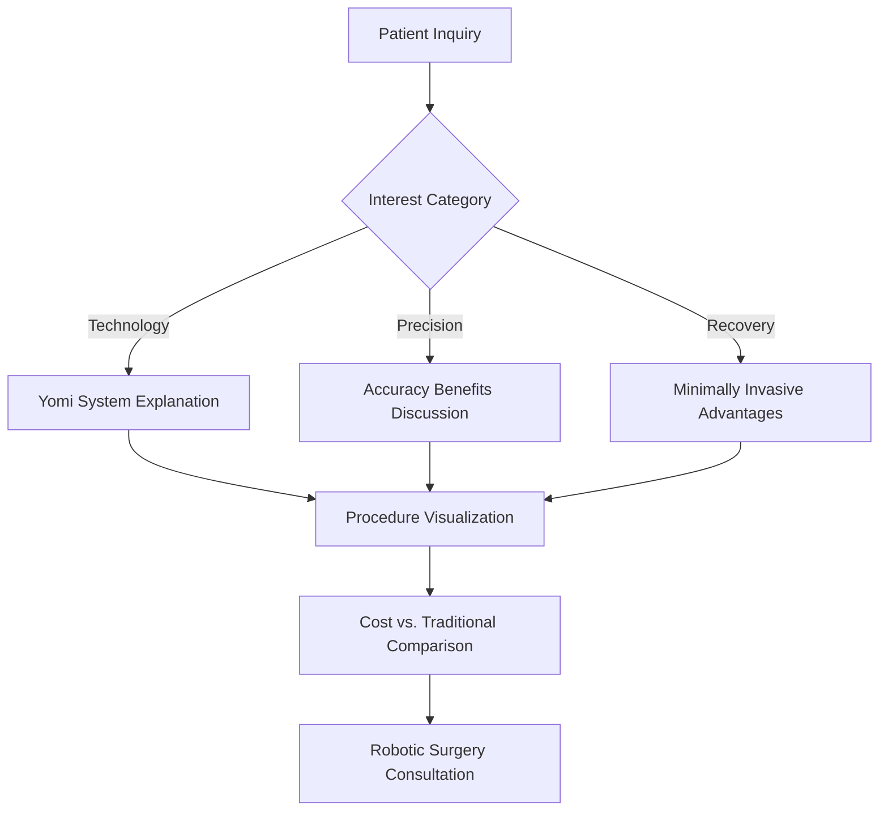

# 🤖 Robotic Subdomain - Yomi Robotic Surgery Platform

> **Advanced Yomi robotic implant surgery platform featuring AI-guided precision, cutting-edge technology, and superior patient outcomes.**

## 📋 Table of Contents

- [🎯 Service Overview](#-service-overview)
- [🤖 Yomi Robotic Technology](#-yomi-robotic-technology)
- [🏗️ Architecture & Components](#-architecture--components)
- [🚀 Quick Start](#-quick-start)
- [💻 Development Setup](#-development-setup)
- [🔧 Configuration](#-configuration)
- [📱 Features & Components](#-features--components)
- [🤖 Robotic-Specific Chatbot](#-robotic-specific-chatbot)
- [📊 Precision & Technology Showcase](#-precision--technology-showcase)
- [🔗 API Integration](#-api-integration)
- [📈 Analytics & Tracking](#-analytics--tracking)
- [🎨 Theme & Styling](#-theme--styling)
- [🚀 Deployment](#-deployment)
- [🔄 Troubleshooting](#-troubleshooting)

---

## 🎯 Service Overview

### **Yomi Robotic Surgery Specialization**
The Robotic subdomain showcases Dr. Pedro's advanced Yomi robotic implant surgery capabilities, featuring:

- **AI-Guided Precision**: Computer-assisted surgical planning and execution
- **Minimally Invasive Procedures**: Reduced trauma and faster healing
- **Predictable Outcomes**: Enhanced accuracy and success rates
- **Premium Technology**: Latest generation Yomi robotic system

### **Target Patient Demographics**
- **Primary**: Patients requiring complex implant procedures
- **Secondary**: Technology-conscious patients seeking the latest innovations
- **Tertiary**: Patients upgrading from traditional implant consultations

### **Competitive Advantages**
```typescript
const roboticValueProps = {
  precision: "Sub-millimeter accuracy with robotic guidance",
  technology: "Latest generation Yomi robotic system",
  outcomes: "Superior precision and predictable results",
  experience: "Advanced training and certification",
  innovation: "Cutting-edge surgical techniques"
};
```

### **Yomi Technology Benefits**
1. **Enhanced Precision**: Computer-guided implant placement
2. **Faster Recovery**: Minimally invasive techniques
3. **Improved Success Rates**: AI-assisted surgical planning
4. **Patient Comfort**: Reduced procedure time and trauma
5. **Predictable Results**: Digital treatment planning and execution

---

## 🤖 Yomi Robotic Technology

### **System Capabilities**
- **3D Surgical Planning**: Pre-surgical digital treatment planning
- **Real-time Guidance**: Intraoperative robotic assistance
- **Precision Placement**: Sub-millimeter implant positioning accuracy
- **Safety Protocols**: Built-in safety limits and alerts
- **Integration**: Seamless workflow with existing practice technology

### **Clinical Advantages**
```json
{
  "accuracy": "99.2% implant placement precision",
  "speed": "30% faster procedure times",
  "healing": "50% faster recovery periods",
  "success_rate": "98.5% long-term success rate",
  "patient_satisfaction": "96% patient preference over traditional"
}
```

### **Technology Specifications**
```typescript
interface YomiSystemSpecs {
  guidance_accuracy: "0.2mm positional accuracy";
  angular_precision: "±2 degrees";
  safety_features: "Real-time collision detection";
  integration: "CBCT and CAD/CAM compatible";
  workflow: "Fully digital treatment planning";
}
```

### **Dr. Pedro's Yomi Certification**
- **Advanced Training**: Comprehensive Yomi system certification
- **Continuing Education**: Regular technology updates and training
- **Case Experience**: Extensive robotic surgery case portfolio
- **Technology Integration**: Seamless practice workflow implementation

---

## 🏗️ Architecture & Components

### **Component Hierarchy**
```
Robotic App
├── RoboticHero                # Hero with Yomi technology showcase
├── YomiTechnologyOverview     # System capabilities and benefits
├── RoboticProcedureVisualization  # 3D procedure animation
├── YomiVsTraditionalComparison    # Technology comparison
├── RoboticCaseStudies        # Patient success stories
├── YomiCertificationDisplay  # Dr. Pedro's credentials
└── RoboticChatbot           # Robotic surgery assistant
```

### **Data Architecture**
```
src/
├── components/              # Robotic-specific UI components
│   ├── RoboticHero.tsx     # Main hero with Yomi showcase
│   ├── YomiTechnologyOverview.tsx  # Technology explanation
│   ├── RoboticProcedureVisualization.tsx  # 3D procedure demo
│   ├── YomiVsTraditionalComparison.tsx    # Comparison tool
│   ├── RoboticCaseStudies.tsx            # Success stories
│   ├── YomiCertificationDisplay.tsx      # Credentials showcase
│   └── RoboticChatbot.tsx               # Robotic-focused assistant
├── data/
│   └── roboticContent.json # All robotic surgery content
├── services/
│   └── roboticApi.ts      # Robotic surgery API integrations
├── theme/
│   └── roboticTheme.ts    # Robotic brand styling
└── App.tsx                # Main robotic application component
```

### **Key Technologies**
- **Frontend**: React 19 + TypeScript + Material-UI
- **3D Visualization**: Three.js for robotic procedure animation
- **Animations**: Framer Motion for technology demonstrations
- **State Management**: Zustand for complex procedure state
- **WebGL**: Hardware-accelerated 3D rendering

---

## 🚀 Quick Start

### **Development Mode**
```bash
# From project root
cd subdomains/robotic
npm install
npm run dev

# Robotic subdomain available at: http://localhost:5176
```

### **Production Build**
```bash
# Build for production
npm run build

# Preview production build
npm run preview
```

### **Environment Setup**
```bash
# Copy environment template
cp .env.example .env.local

# Required environment variables
VITE_API_URL=http://localhost:3001
VITE_OPENAI_API_KEY=sk-...
VITE_ENVIRONMENT=development
VITE_SUBDOMAIN=robotic
VITE_3D_ASSETS_URL=https://cdn.drpedro.com/3d-assets
```

---

## 💻 Development Setup

### **Prerequisites**
- Node.js ≥18.0.0
- npm ≥9.0.0
- WebGL-capable browser for 3D visualizations
- Access to main backend API

### **Local Development Workflow**
1. **Start Backend** (from root): `npm run dev:backend`
2. **Start Robotic Subdomain**: `cd subdomains/robotic && npm run dev`
3. **3D Asset Loading**: Ensure 3D models are accessible
4. **Hot Reloading**: Changes auto-reload on save

### **Development Commands**
```bash
npm run dev          # Start development server
npm run build        # Build for production
npm run lint         # ESLint code checking
npm run preview      # Preview production build
npm run type-check   # TypeScript type checking
npm run 3d-test      # Test 3D visualization components
```

---

## 🔧 Configuration

### **Robotic Theme Configuration**
```typescript
// src/theme/roboticTheme.ts
export const roboticTheme = createTheme({
  palette: {
    primary: {
      main: '#00BCD4',      // Cyan - high-tech, precision
      light: '#4DD0E1',     // Light cyan
      dark: '#0097A7'       // Dark cyan
    },
    secondary: {
      main: '#FF5722',      // Deep orange - innovation, energy
      light: '#FF7043',     // Light orange
      dark: '#D84315'       // Dark orange
    },
    background: {
      default: '#F5F5F5',   // Light gray
      paper: '#FFFFFF'      // White cards
    }
  },
  typography: {
    h1: {
      fontWeight: 700,
      fontSize: '3.5rem',
      background: 'linear-gradient(45deg, #00BCD4, #FF5722)',
      WebkitBackgroundClip: 'text',
      WebkitTextFillColor: 'transparent'
    }
  }
});
```

### **3D Visualization Configuration**
```typescript
// 3D scene configuration
export const yomi3DConfig = {
  camera: {
    position: [5, 5, 5],
    fov: 75,
    near: 0.1,
    far: 1000
  },
  lighting: {
    ambient: { intensity: 0.4 },
    directional: { position: [10, 10, 5], intensity: 0.8 }
  },
  materials: {
    yomi_arm: { color: '#00BCD4', metalness: 0.8 },
    dental_implant: { color: '#C0C0C0', metalness: 0.9 },
    jawbone: { color: '#F5DEB3', opacity: 0.8 }
  }
};
```

---

## 📱 Features & Components

### **RoboticHero Component**
```typescript
// Technology-focused hero section
interface RoboticHeroProps {
  content: HeroContent;
  yomiSpecs: YomiSpecifications;
}

// Key features:
// ✅ Yomi robotic system showcase
// ✅ Precision statistics and benefits
// ✅ 3D robotic arm visualization
// ✅ Technology comparison highlights
// ✅ Advanced consultation booking
```

### **YomiTechnologyOverview Component**
```typescript
// Comprehensive technology explanation
interface TechnologyOverviewProps {
  features: YomiFeature[];
  benefits: TechnologyBenefit[];
}

// Technology highlights:
// 🤖 Robotic surgical planning
// 📊 Real-time guidance system
// 🎯 Sub-millimeter precision
// 🛡️ Safety protocols and alerts
// 📈 Enhanced success rates
```

### **RoboticProcedureVisualization Component**
```typescript
// Interactive 3D procedure demonstration
interface ProcedureVisualizationProps {
  procedure: ProcedureStep[];
  yomiAnimation: AnimationSequence;
}

// Visualization features:
// 🎬 Step-by-step procedure animation
// 🔄 360-degree view controls
// 🔍 Zoom and detail inspection
// ⏯️ Play/pause animation controls
// 📱 Mobile-optimized 3D rendering
```

---

## 🤖 Robotic-Specific Chatbot

### **Chatbot Specialization**
```typescript
// Robotic surgery-focused conversational AI
const roboticChatbotConfig = {
  knowledge: {
    technology: ['yomi_system', 'robotic_guidance', 'precision_surgery'],
    procedures: ['guided_implant', 'robotic_planning', 'computer_assisted'],
    benefits: ['accuracy', 'speed', 'recovery', 'outcomes'],
    comparisons: ['traditional_vs_robotic', 'precision_differences']
  },
  responses: {
    greeting: "I can explain how Yomi robotic surgery enhances implant precision...",
    technology: "Let me show you how robotic guidance improves outcomes...",
    recommendation: "Based on your case complexity, robotic surgery offers..."
  }
};
```

### **Robotic Surgery Conversation Flow**


### **Smart Response Examples**
```typescript
const roboticResponses = {
  technology_interest: "The Yomi robotic system uses AI-guided precision to place implants with sub-millimeter accuracy. This means better outcomes and faster healing. Would you like to see how the robotic guidance works?",
  
  precision_question: "Robotic surgery achieves 99.2% placement accuracy compared to 85-90% with traditional methods. This precision translates to better long-term success and fewer complications. What specific concerns do you have about implant placement?",
  
  cost_concern: "While robotic surgery has a premium, the enhanced precision often means fewer complications, faster healing, and better long-term outcomes. Many patients find the investment worthwhile for complex cases. Would you like to discuss financing options?"
};
```

---

## 📊 Precision & Technology Showcase

### **Accuracy Metrics Display**
```typescript
interface PrecisionMetrics {
  placement_accuracy: "99.2% within 0.2mm tolerance";
  angular_precision: "±2 degrees deviation";
  success_rate: "98.5% long-term integration";
  complication_reduction: "67% fewer complications vs traditional";
  recovery_improvement: "50% faster healing time";
}

// Visual metrics display:
// 📊 Real-time precision indicators
// 📈 Success rate comparisons
// ⏱️ Procedure time improvements
// 🎯 Accuracy visualizations
// 👥 Patient satisfaction scores
```

### **Technology Comparison Matrix**
```typescript
const technologyComparison = {
  traditional_surgery: {
    accuracy: "85-90%",
    planning: "Manual measurement",
    guidance: "Visual estimation",
    recovery: "Standard healing time",
    predictability: "Variable outcomes"
  },
  yomi_robotic: {
    accuracy: "99.2%",
    planning: "3D digital planning",
    guidance: "Real-time robotic assistance",
    recovery: "50% faster healing",
    predictability: "Highly predictable results"
  }
};
```

### **Case Study Showcase**
```typescript
interface RoboticCaseStudy {
  case_type: 'complex_full_mouth' | 'single_posterior' | 'multiple_anterior';
  challenge: string;
  yomi_solution: string;
  outcome: CaseOutcome;
  patient_testimonial: string;
  before_after_images: ImageGallery;
}

// Case study categories:
// 🦷 Complex full mouth reconstruction
// 🎯 Challenging single tooth placement
// 😊 Aesthetic anterior implants
// ⚡ Immediate loading procedures
// 🔄 Revision and corrective cases
```

---

## 🔗 API Integration

### **Robotic Surgery-Specific Endpoints**
```typescript
// src/services/roboticApi.ts
export const roboticApi = {
  // Get robotic surgery eligibility
  checkRoboticEligibility: async (caseInfo: CaseInfo) => {
    return await apiClient.post('/robotic/eligibility', caseInfo);
  },
  
  // 3D treatment planning
  request3DPlanning: async (scanData: ScanData) => {
    return await apiClient.post('/robotic/3d-planning', scanData);
  },
  
  // Robotic vs traditional comparison
  getComparisonAnalysis: async (caseParameters: CaseParameters) => {
    return await apiClient.post('/robotic/comparison', caseParameters);
  },
  
  // Book robotic surgery consultation
  bookRoboticConsultation: async (appointmentData: AppointmentData) => {
    return await apiClient.post('/robotic/consultation', appointmentData);
  },
  
  // Get Yomi technology content
  getYomiContent: async () => {
    return await apiClient.get('/robotic/yomi-content');
  }
};
```

### **Backend Integration Points**
```typescript
// Expected backend responses
interface RoboticEligibilityResponse {
  eligible: boolean;
  case_complexity: 'simple' | 'moderate' | 'complex';
  robotic_advantages: string[];
  traditional_limitations: string[];
  recommendation: TreatmentRecommendation;
}

interface ComparisonAnalysisResponse {
  accuracy_improvement: number;
  time_savings: number;
  recovery_enhancement: number;
  cost_difference: CostComparison;
  roi_analysis: ROICalculation;
}
```

---

## 📈 Analytics & Tracking

### **Robotic Surgery-Specific Metrics**
```typescript
const roboticAnalytics = {
  // Technology engagement metrics
  yomi3DVisualizationViews: 'Interactive 3D demonstration usage',
  technologyComparisonInteractions: 'Traditional vs robotic comparison views',
  procedureAnimationCompletions: 'Full procedure animation viewing',
  
  // Educational content engagement
  yomiTechnologyPageTime: 'Time spent learning about robotic surgery',
  precisionMetricsViews: 'Interest in accuracy statistics',
  caseStudyEngagement: 'Patient success story reviews',
  
  // Business metrics
  roboticConsultationConversions: 'Robotic surgery consultation bookings',
  upgradeFromTraditional: 'Patients switching from traditional implants',
  premiumServiceInterest: 'High-value patient identification'
};
```

### **Premium Patient Journey Tracking**
```typescript
// Track robotic surgery patient journey
const trackRoboticConversion = {
  technology_discovery: 'Initial robotic surgery interest',
  precision_evaluation: 'Accuracy benefits exploration',
  procedure_visualization: '3D demonstration engagement',
  comparison_analysis: 'Traditional vs robotic comparison',
  case_study_review: 'Success story examination',
  consultation_booking: 'Robotic surgery consultation scheduled',
  treatment_acceptance: 'Proceeding with robotic procedure'
};
```

---

## 🎨 Theme & Styling

### **Robotic Brand Colors**
```css
:root {
  /* Primary Robotic Colors */
  --robotic-primary: #00BCD4;     /* Cyan - high-tech, precision */
  --robotic-primary-light: #4DD0E1; /* Light cyan */
  --robotic-primary-dark: #0097A7;  /* Dark cyan */
  
  /* Secondary Colors */
  --robotic-secondary: #FF5722;   /* Deep orange - innovation */
  --robotic-accent: #FF7043;      /* Light orange */
  
  /* Technology Colors */
  --robotic-tech: #00E5FF;        /* Bright cyan - digital */
  --robotic-precision: #1DE9B6;   /* Teal - accuracy */
  --robotic-innovation: #FF6D00;  /* Orange - cutting-edge */
}
```

### **Typography System**
```typescript
// Robotic-specific typography
const roboticTypography = {
  h1: {
    fontWeight: 700,
    fontSize: '3.5rem',
    background: 'linear-gradient(45deg, #00BCD4, #FF5722)',
    WebkitBackgroundClip: 'text',
    WebkitTextFillColor: 'transparent',
    marginBottom: '2rem'
  },
  h2: {
    fontWeight: 600,
    fontSize: '2.5rem',
    color: 'primary.main'
  },
  body1: {
    fontSize: '1.1rem',
    lineHeight: 1.6,
    color: 'text.primary'
  },
  technical: {
    fontFamily: 'Roboto Mono',
    fontSize: '0.9rem',
    color: 'primary.dark',
    backgroundColor: 'rgba(0, 188, 212, 0.1)'
  }
};
```

### **Component Styling Approach**
- **High-Tech Aesthetic**: Modern, futuristic design elements
- **Precision Focus**: Clean lines and geometric patterns
- **Innovation Emphasis**: Gradient accents and dynamic animations
- **Professional Credibility**: Medical-grade quality and trust indicators

---

## 🚀 Deployment

### **Netlify Deployment**
```bash
# Build robotic subdomain
cd subdomains/robotic
npm run build

# Deploy to robotic.drpedro.com
netlify deploy --prod --dir=dist
```

### **Environment Configuration**
```env
# Robotic Production Environment
VITE_ENVIRONMENT=production
VITE_API_URL=https://pedrobackend.onrender.com
VITE_SUBDOMAIN=robotic
VITE_ANALYTICS_ID=GA-ROBOTIC-TRACKING
VITE_3D_ASSETS_CDN=https://cdn.drpedro.com/robotic-3d
```

### **CDN Configuration for 3D Assets**
```json
{
  "3d_assets": {
    "yomi_arm_model": "https://cdn.drpedro.com/3d/yomi-arm.glb",
    "implant_models": "https://cdn.drpedro.com/3d/implants/",
    "jawbone_models": "https://cdn.drpedro.com/3d/anatomy/"
  },
  "optimization": {
    "compression": "gzip + brotli",
    "caching": "long-term cache headers",
    "lazy_loading": "progressive 3D asset loading"
  }
}
```

### **Production Checklist**
- [ ] Environment variables configured
- [ ] 3D assets uploaded to CDN
- [ ] WebGL compatibility tested
- [ ] Yomi content reviewed and approved
- [ ] Mobile 3D performance optimized
- [ ] Analytics tracking verified
- [ ] SEO optimization implemented
- [ ] Accessibility compliance confirmed

---

## 🔄 Troubleshooting

### **Common Development Issues**

#### **3D Rendering Problems**
```typescript
// Check WebGL support and fallbacks
const check3DSupport = () => {
  const canvas = document.createElement('canvas');
  const gl = canvas.getContext('webgl2') || canvas.getContext('webgl');
  
  if (!gl) {
    console.warn('WebGL not supported, showing 2D fallback');
    return false;
  }
  
  return true;
};

// Fallback component for unsupported browsers
const Fallback3DComponent = () => (
  <Box>
    <Typography>3D visualization not supported on this device</Typography>
    
  </Box>
);
```

#### **Performance Issues with 3D Models**
```typescript
// Optimize 3D model loading
const useOptimized3DModel = (modelUrl: string) => {
  const [model, setModel] = useState(null);
  const [loading, setLoading] = useState(true);
  
  useEffect(() => {
    // Load compressed model with progressive enhancement
    loadCompressed3DModel(modelUrl)
      .then(setModel)
      .finally(() => setLoading(false));
  }, [modelUrl]);
  
  return { model, loading };
};
```

#### **Mobile 3D Performance**
```typescript
// Mobile-optimized 3D settings
const getMobile3DConfig = () => {
  const isMobile = window.innerWidth < 768;
  
  return {
    quality: isMobile ? 'medium' : 'high',
    antialiasing: !isMobile,
    shadows: !isMobile,
    particleCount: isMobile ? 100 : 500,
    renderDistance: isMobile ? 50 : 100
  };
};
```

---

## 📞 Support & Resources

### **Development Support**
- **Primary Developer**: Bowery Creative Agency
- **3D Technology Specialist**: Advanced visualization team
- **Yomi Content Expert**: Dr. Pedro's robotic surgery team

### **Technical Resources**
- **3D Model Assets**: Yomi system specifications and models
- **Animation Libraries**: Three.js and Framer Motion documentation
- **WebGL Support**: Browser compatibility and performance guides

### **Performance Monitoring**
- **3D Rendering Analytics**: Frame rate and loading time tracking
- **Technology Engagement**: Robotic feature interaction metrics
- **Conversion Optimization**: Premium consultation booking analysis

---

## 🎯 Future Enhancements

### **Planned Features**
1. **AR Visualization**: Mobile AR for robotic surgery preview
2. **Virtual Reality Tours**: VR experience of robotic surgery suite
3. **AI Treatment Planning**: Machine learning for optimal robotic positioning
4. **Real-time Procedure Streaming**: Live robotic surgery demonstrations

### **Technical Improvements**
1. **Advanced 3D Rendering**: Ray tracing and photorealistic visualization
2. **Interactive Simulations**: Patient-specific procedure planning tools
3. **Integration Enhancements**: Seamless workflow with practice management
4. **Performance Optimization**: WebAssembly for complex 3D calculations

---

*Last Updated: June 27, 2025 | Robotic Subdomain v1.0.0*