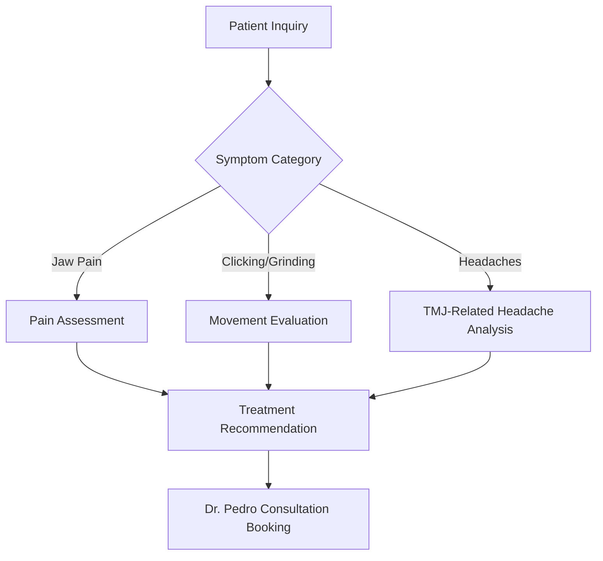

# 🦷 TMJ Subdomain - Comprehensive TMJ Treatment Platform

> **Specialized TMJ/TMD treatment platform featuring Dr. Pedro's 30+ years of expertise, advanced therapies, and intelligent patient assessment tools.**

## 📋 Table of Contents

- [🎯 Service Overview](#-service-overview)
- [👨‍⚕️ Dr. Pedro's TMJ Expertise](#-dr-pedros-tmj-expertise)
- [🏗️ Architecture & Components](#-architecture--components)
- [🚀 Quick Start](#-quick-start)
- [💻 Development Setup](#-development-setup)
- [🔧 Configuration](#-configuration)
- [📱 Features & Components](#-features--components)
- [🤖 TMJ-Specific Chatbot](#-tmj-specific-chatbot)
- [📊 Patient Assessment System](#-patient-assessment-system)
- [🔗 API Integration](#-api-integration)
- [📈 Analytics & Tracking](#-analytics--tracking)
- [🎨 Theme & Styling](#-theme--styling)
- [🚀 Deployment](#-deployment)
- [🔄 Troubleshooting](#-troubleshooting)

---

## 🎯 Service Overview

### **TMJ/TMD Specialization**
The TMJ subdomain serves as Dr. Pedro's comprehensive platform for temporomandibular joint disorder treatment, featuring:

- **Advanced Treatment Modalities**: BOTOX therapy, electrophoresis, acoustic shockwave therapy
- **Expert Diagnosis**: 30+ years of TMJ experience with 95% patient pain relief rate
- **Comprehensive Assessment**: Intelligent symptom evaluation and treatment planning
- **Educational Resources**: Dr. Pedro's published TMJ syndrome guide

### **Target Patient Demographics**
- **Primary**: Patients experiencing jaw pain, clicking, grinding, or dysfunction
- **Secondary**: Headache sufferers seeking root cause treatment
- **Tertiary**: Patients referred for complex TMJ cases requiring specialist care

### **Business Value Proposition**
```typescript
const tmjValueProps = {
  expertise: "30+ years TMJ specialization",
  successRate: "95% patient pain relief",
  technology: "Advanced BOTOX + electrophoresis + acoustic therapy",
  credentials: "Board-certified TMJ specialist & published author",
  approach: "Comprehensive diagnosis with personalized treatment plans"
};
```

---

## 👨‍⚕️ Dr. Pedro's TMJ Expertise

### **Professional Credentials**
- **Education**: Temple University School of Dentistry - DMD
- **Specialization**: Board-Certified Prosthodontist & TMJ Specialist
- **Certifications**: 
  - ADA Certified Prosthodontist
  - TMJ Specialist Certification - BOTOX FOR DENTISTS
  - Yomi Robotic System Certified
  - Staten Island Hall of Fame Inductee

### **Published Authority**
- **Book**: "TMJ Syndrome: A Comprehensive Guide"
- **Content**: Diagnosis, short-term solutions, long-term treatment options
- **Innovation**: Cutting-edge technological approaches to TMJ treatment

### **Treatment Philosophy**
```json
{
  "approach": "Evidence-based comprehensive care",
  "methodology": "Combine traditional expertise with modern technology",
  "focus": "Address root causes, not just symptoms",
  "commitment": "Personalized treatment plans for lasting relief"
}
```

---

## 🏗️ Architecture & Components

### **Component Hierarchy**
```
TMJ App
├── TMJHero                    # Hero section with statistics
├── TMJSymptomAssessment      # Interactive symptom checker
├── TMJTreatmentTimeline      # Treatment process overview
└── TMJChatbot                # Specialized TMJ assistant
```

### **Data Architecture**
```
src/
├── components/               # TMJ-specific UI components
│   ├── TMJHero.tsx          # Main hero with doctor credentials
│   ├── TMJSymptomAssessment.tsx  # Patient symptom evaluation
│   ├── TMJTreatmentTimeline.tsx  # Treatment step visualization
│   └── TMJChatbot.tsx       # TMJ-focused conversational AI
├── data/
│   └── tmjContent.json      # All TMJ content and configurations
├── services/
│   └── tmjApi.ts           # TMJ-specific API integrations
├── theme/
│   └── tmjTheme.ts         # TMJ brand styling and colors
└── App.tsx                 # Main TMJ application component
```

### **Key Technologies**
- **Frontend**: React 19 + TypeScript + Material-UI
- **Animations**: Framer Motion for smooth interactions
- **State Management**: React hooks + context
- **API Layer**: Axios for backend communication
- **Theme System**: Custom TMJ-branded Material-UI theme

---

## 🚀 Quick Start

### **Development Mode**
```bash
# From project root
cd subdomains/tmj
npm install
npm run dev

# TMJ subdomain available at: http://localhost:5174
```

### **Production Build**
```bash
# Build for production
npm run build

# Preview production build
npm run preview
```

### **Environment Setup**
```bash
# Copy environment template
cp .env.example .env.local

# Required environment variables
VITE_API_URL=http://localhost:3001
VITE_OPENAI_API_KEY=sk-...
VITE_ENVIRONMENT=development
```

---

## 💻 Development Setup

### **Prerequisites**
- Node.js ≥18.0.0
- npm ≥9.0.0
- Access to main backend API

### **Local Development Workflow**
1. **Start Backend** (from root): `npm run dev:backend`
2. **Start TMJ Subdomain**: `cd subdomains/tmj && npm run dev`
3. **Hot Reloading**: Changes auto-reload on save
4. **Shared Components**: Updates propagate from `/shared/`

### **Development Commands**
```bash
npm run dev          # Start development server
npm run build        # Build for production
npm run lint         # ESLint code checking
npm run preview      # Preview production build
npm run type-check   # TypeScript type checking
```

### **File Structure Development**
```typescript
// Adding new TMJ components
src/components/NewTMJComponent.tsx  // New component
src/data/tmjContent.json           // Add content data
src/services/tmjApi.ts             // Add API calls
src/theme/tmjTheme.ts              // Style customizations
```

---

## 🔧 Configuration

### **TMJ Theme Configuration**
```typescript
// src/theme/tmjTheme.ts
export const tmjTheme = createTheme({
  palette: {
    primary: {
      main: '#2C5530',      // TMJ green primary
      light: '#4A7C59',     // Lighter green
      dark: '#1B3A1F'       // Darker green
    },
    secondary: {
      main: '#8BC34A',      // Accent green
      light: '#AED581',     // Light accent
      dark: '#689F38'       // Dark accent
    }
  },
  typography: {
    h1: {
      fontWeight: 700,
      fontSize: '3rem',
      lineHeight: 1.2
    }
  }
});
```

### **Content Management**
```json
// src/data/tmjContent.json structure
{
  "hero": {
    "title": "TMJ & Temporomandibular Disorder Specialist",
    "statistics": [
      {"number": "30+", "label": "Years of TMJ Experience"},
      {"number": "95%", "label": "Patient Pain Relief Rate"},
      {"number": "1000+", "label": "TMJ Cases Treated"}
    ]
  },
  "treatments": [
    {
      "name": "BOTOX Therapy",
      "description": "Targeted muscle relaxation for TMJ relief",
      "duration": "15-30 minutes",
      "effectiveness": "85-95% pain reduction"
    }
  ]
}
```

---

## 📱 Features & Components

### **TMJHero Component**
```typescript
// Primary hero section features
interface TMJHeroProps {
  content: HeroContent;
  doctor: DoctorInfo;
}

// Key features:
// ✅ Doctor credentials display
// ✅ 30+ years experience highlight
// ✅ Success statistics (95% relief rate)
// ✅ Immediate appointment booking
// ✅ Phone call direct connection
```

### **TMJSymptomAssessment Component**
```typescript
// Interactive symptom checker
interface SymptomAssessmentProps {
  symptoms: SymptomCategory[];
}

// Assessment categories:
// 🔍 Jaw pain and clicking
// 🔍 Headaches and ear pain  
// 🔍 Muscle tension and grinding
// 🔍 Limited jaw movement
// 🔍 Sleep disruption patterns
```

### **TMJTreatmentTimeline Component**
```typescript
// Treatment process visualization
interface TreatmentTimelineProps {
  timeline: TimelineStep[];
  treatments: TreatmentOption[];
}

// Timeline stages:
// 1️⃣ Initial consultation and diagnosis
// 2️⃣ Comprehensive TMJ assessment
// 3️⃣ Personalized treatment plan
// 4️⃣ Active treatment phase
// 5️⃣ Follow-up and maintenance
```

---

## 🤖 TMJ-Specific Chatbot

### **Chatbot Specialization**
```typescript
// TMJ-focused conversational AI
const tmjChatbotConfig = {
  knowledge: {
    conditions: ['TMJ', 'TMD', 'bruxism', 'jaw_pain'],
    treatments: ['botox', 'electrophoresis', 'acoustic_therapy'],
    symptoms: ['clicking', 'grinding', 'headaches', 'ear_pain']
  },
  responses: {
    greeting: "I'm here to help with your TMJ concerns...",
    assessment: "Let me ask about your jaw symptoms...",
    recommendation: "Based on your symptoms, Dr. Pedro can help..."
  }
};
```

### **TMJ Conversation Flow**


### **Smart Response Examples**
```typescript
const tmjResponses = {
  jawPain: "Jaw pain can significantly impact daily life. Dr. Pedro's BOTOX therapy has helped 95% of patients achieve substantial pain relief. When did your jaw pain first start?",
  
  clicking: "Jaw clicking often indicates TMJ joint dysfunction. Dr. Pedro uses advanced acoustic therapy to address the root cause. Have you noticed any patterns to when the clicking occurs?",
  
  headaches: "Many patients don't realize their chronic headaches stem from TMJ disorders. Dr. Pedro's comprehensive approach treats both the jaw dysfunction and resulting headaches."
};
```

---

## 📊 Patient Assessment System

### **Symptom Scoring Algorithm**
```typescript
interface SymptomScore {
  category: 'pain' | 'function' | 'frequency';
  severity: 1 | 2 | 3 | 4 | 5;
  impact: 'mild' | 'moderate' | 'severe';
}

// Scoring system:
// 🟢 1-2: Mild symptoms, conservative treatment
// 🟡 3-4: Moderate symptoms, targeted therapy
// 🔴 4-5: Severe symptoms, comprehensive treatment plan
```

### **Assessment Categories**
1. **Pain Assessment**
   - Jaw joint pain intensity
   - Muscle pain and tension
   - Referred pain (headaches, ear pain)

2. **Functional Assessment**
   - Jaw opening limitation
   - Chewing difficulty
   - Speech impact

3. **Frequency Assessment**
   - Daily symptom occurrence
   - Trigger identification
   - Sleep disruption patterns

### **Personalized Recommendations**
```typescript
const generateTMJRecommendation = (assessment: SymptomScore[]) => {
  const totalScore = assessment.reduce((sum, score) => sum + score.severity, 0);
  
  if (totalScore <= 8) {
    return {
      urgency: 'routine',
      treatment: 'conservative_management',
      timeframe: '2-4_weeks'
    };
  } else if (totalScore <= 15) {
    return {
      urgency: 'moderate',
      treatment: 'botox_therapy',
      timeframe: '1-2_weeks'
    };
  } else {
    return {
      urgency: 'urgent',
      treatment: 'comprehensive_tmj_plan',
      timeframe: 'within_1_week'
    };
  }
};
```

---

## 🔗 API Integration

### **TMJ-Specific Endpoints**
```typescript
// src/services/tmjApi.ts
export const tmjApi = {
  // Symptom assessment submission
  submitAssessment: async (assessment: TMJAssessment) => {
    return await apiClient.post('/tmj/assessment', assessment);
  },
  
  // Get TMJ treatment options
  getTreatmentOptions: async (severity: string) => {
    return await apiClient.get(`/tmj/treatments?severity=${severity}`);
  },
  
  // Book TMJ consultation
  bookConsultation: async (patientInfo: PatientInfo) => {
    return await apiClient.post('/tmj/consultation', patientInfo);
  },
  
  // Get Dr. Pedro's TMJ content
  getTMJContent: async () => {
    return await apiClient.get('/tmj/content');
  }
};
```

### **Backend Integration Points**
```typescript
// Expected backend responses
interface TMJAssessmentResponse {
  score: number;
  severity: 'mild' | 'moderate' | 'severe';
  recommendations: TreatmentRecommendation[];
  urgency: 'routine' | 'priority' | 'urgent';
}

interface TreatmentRecommendation {
  type: 'botox' | 'electrophoresis' | 'acoustic_therapy';
  description: string;
  expectedOutcome: string;
  duration: string;
  cost_range: string;
}
```

---

## 📈 Analytics & Tracking

### **TMJ-Specific Metrics**
```typescript
const tmjAnalytics = {
  // Patient engagement metrics
  symptomAssessmentCompletions: 'Track assessment completion rate',
  treatmentInquiries: 'Monitor treatment option interest',
  consultationBookings: 'Measure conversion to appointment',
  
  // Content engagement
  timeOnTreatmentTimeline: 'User engagement with treatment info',
  chatbotInteractions: 'TMJ-specific conversation analysis',
  doctorCredentialViews: 'Interest in Dr. Pedro\'s expertise',
  
  // Business metrics
  leadQuality: 'Assessment scores vs actual treatment needs',
  patientJourneyMapping: 'Path from inquiry to treatment',
  crossSellOpportunities: 'TMJ → other service interest'
};
```

### **Conversion Tracking**
```typescript
// Track TMJ patient journey
const trackTMJConversion = {
  initial_visit: 'Landing page view',
  symptom_assessment: 'Assessment tool usage',
  treatment_interest: 'Treatment option exploration',
  doctor_confidence: 'Credentials/experience review',
  booking_intent: 'Consultation request initiation',
  appointment_booked: 'Successful conversion'
};
```

---

## 🎨 Theme & Styling

### **TMJ Brand Colors**
```css
:root {
  /* Primary TMJ Colors */
  --tmj-primary: #2C5530;      /* Deep green - trust, health */
  --tmj-primary-light: #4A7C59; /* Lighter green */
  --tmj-primary-dark: #1B3A1F;  /* Darker green */
  
  /* Secondary Colors */
  --tmj-secondary: #8BC34A;     /* Accent green - growth, healing */
  --tmj-accent: #AED581;        /* Light accent */
  
  /* Functional Colors */
  --tmj-success: #4CAF50;       /* Treatment success */
  --tmj-warning: #FF9800;       /* Moderate symptoms */
  --tmj-error: #F44336;         /* Severe symptoms */
}
```

### **Typography System**
```typescript
// TMJ-specific typography
const tmjTypography = {
  h1: {
    fontWeight: 700,
    fontSize: '3rem',
    color: 'primary.main',
    marginBottom: '1rem'
  },
  body1: {
    fontSize: '1.1rem',
    lineHeight: 1.6,
    color: 'text.primary'
  },
  caption: {
    fontSize: '0.875rem',
    color: 'text.secondary',
    fontStyle: 'italic'
  }
};
```

### **Component Styling Approach**
- **Consistent Brand Identity**: TMJ green color scheme throughout
- **Professional Medical Aesthetic**: Clean, trustworthy design
- **Accessibility**: WCAG 2.1 AA compliance
- **Mobile-First**: Responsive design for all devices

---

## 🚀 Deployment

### **Netlify Deployment**
```bash
# Build TMJ subdomain
cd subdomains/tmj
npm run build

# Deploy to tmj.drpedro.com
netlify deploy --prod --dir=dist
```

### **Environment Configuration**
```env
# TMJ Production Environment
VITE_ENVIRONMENT=production
VITE_API_URL=https://pedrobackend.onrender.com
VITE_SUBDOMAIN=tmj
VITE_ANALYTICS_ID=GA-TMJ-TRACKING
```

### **DNS Configuration**
```dns
# DNS CNAME record
tmj.drpedro.com CNAME drpedro.netlify.app
```

### **Production Checklist**
- [ ] Environment variables configured
- [ ] API endpoints tested
- [ ] TMJ content reviewed and approved
- [ ] Analytics tracking verified
- [ ] Mobile responsiveness confirmed
- [ ] Accessibility testing completed
- [ ] SEO optimization implemented

---

## 🔄 Troubleshooting

### **Common Development Issues**

#### **Port Conflicts**
```bash
# If port 5174 is in use
npx kill-port 5174
npm run dev
```

#### **API Connection Issues**
```typescript
// Check backend connectivity
const testApiConnection = async () => {
  try {
    const response = await fetch(`${import.meta.env.VITE_API_URL}/health`);
    console.log('Backend Status:', response.status);
  } catch (error) {
    console.error('Backend not accessible:', error);
  }
};
```

#### **Theme Not Loading**
```typescript
// Verify theme provider setup
import { ThemeProvider } from '@mui/material/styles';
import { tmjTheme } from './theme/tmjTheme';

// Ensure theme is properly wrapped
<ThemeProvider theme={tmjTheme}>
  <App />
</ThemeProvider>
```

### **Performance Optimization**

#### **Bundle Size Optimization**
```typescript
// Lazy load heavy components
const TMJSymptomAssessment = React.lazy(() => 
  import('./components/TMJSymptomAssessment')
);

// Use Suspense for loading states
<Suspense fallback={<CircularProgress />}>
  <TMJSymptomAssessment />
</Suspense>
```

#### **Image Optimization**
```typescript
// Optimize TMJ images
const tmjImages = {
  hero: '/images/tmj-hero.webp',
  doctor: '/images/dr-pedro-tmj.webp',
  treatments: '/images/tmj-treatments.webp'
};
```

---

## 📞 Support & Resources

### **Development Support**
- **Primary Developer**: Bowery Creative Agency
- **TMJ Content Expert**: Dr. Pedro's practice team
- **Technical Issues**: See main project README for contact

### **Medical Content Updates**
- **Treatment Information**: Coordinate with Dr. Pedro
- **Pricing Updates**: Practice management approval required
- **New Service Additions**: Full content review process

### **Performance Monitoring**
- **Analytics Dashboard**: Google Analytics + custom tracking
- **Error Monitoring**: Built-in error boundary logging
- **User Feedback**: Integrated feedback collection system

---

## 🎯 Future Enhancements

### **Planned Features**
1. **Virtual TMJ Assessment**: AI-powered video assessment
2. **Treatment Progress Tracking**: Patient portal integration
3. **Telemedicine Integration**: Remote consultations
4. **Educational Content Expansion**: Video library and resources

### **Technical Improvements**
1. **Progressive Web App**: Offline functionality
2. **Advanced Analytics**: Heatmaps and user behavior tracking
3. **A/B Testing Platform**: Content and design optimization
4. **Multi-language Support**: Spanish translation

---

*Last Updated: June 27, 2025 | TMJ Subdomain v1.0.0*